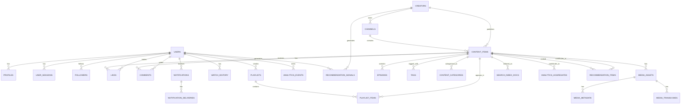

# ER Diagram

```mermaid
erDiagram
    USERS ||--o{ PROFILES : has
    USERS ||--o{ USER_SESSIONS : has
    USERS ||--o{ FOLLOWERS : follows
    USERS ||--o{ LIKES : makes
    USERS ||--o{ COMMENTS : writes
    USERS ||--o{ PLAYLISTS : creates
    USERS ||--o{ WATCH_HISTORY : has
    USERS ||--o{ NOTIFICATIONS : receives
    USERS ||--o{ ANALYTICS_EVENTS : emits

    CREATORS ||--o{ CHANNELS : owns
    CREATORS ||--o{ CONTENT_ITEMS : publishes
    CREATORS ||--o{ RECOMMENDATION_SIGNALS : generates

    CHANNELS ||--o{ CONTENT_ITEMS : contains
    CONTENT_ITEMS ||--o{ EPISODES : contains
    CONTENT_ITEMS ||--o{ TAGS : tagged_with
    CONTENT_ITEMS ||--o{ CONTENT_CATEGORIES : categorized_as
    CONTENT_ITEMS ||--o{ MEDIA_ASSETS : has
    CONTENT_ITEMS ||--o{ LIKES : receives
    CONTENT_ITEMS ||--o{ COMMENTS : has
    CONTENT_ITEMS ||--o{ PLAYLIST_ITEMS : appears_in

    MEDIA_ASSETS ||--o{ MEDIA_METADATA : has
    MEDIA_ASSETS ||--o{ MEDIA_TRANSCODES : has

    PLAYLISTS ||--o{ PLAYLIST_ITEMS : contains

    CONTENT_ITEMS ||--o{ SEARCH_INDEX_DOCS : indexed_as
    CONTENT_ITEMS ||--o{ ANALYTICS_AGGREGATES : contributes_to
    CONTENT_ITEMS ||--o{ RECOMMENDATION_ITEMS : contributes_to

    USERS ||--o{ RECOMMENDATION_SIGNALS : generates
    CONTENT_ITEMS ||--o{ RECOMMENDATION_ITEMS : ranked
    NOTIFICATIONS ||--o{ NOTIFICATION_DELIVERIES : has
```
