# Complete Software Architecture

This document defines the architecture for the Castaminofen FullStack Starter as a content platform that is podcast-first but ecosystem-ready. It intentionally avoids business logic and focuses on boundaries, runtime topology, data flow, and evolution strategy.

## 1. Architecture Intent

The system is designed to support:

- content publishing and consumption
- creator operations and dashboards
- media ingestion, transformation, and streaming
- real-time interaction
- search, recommendations, notifications, and AI-assisted workflows
- long-term growth without a rewrite

The architecture therefore favors:

- explicit domain boundaries
- asynchronous integration between independent capabilities
- a single deployable core in the first phase
- a clear path to domain-based service extraction later

## 2. Core Architectural Decisions

### 2.1 Why Modular Monolith

A modular monolith is chosen because it delivers the fastest route to a reliable initial product while preserving future flexibility. It keeps deployment simple, avoids distributed-system complexity, and allows strong internal module boundaries that can later become services.

Decision rationale:

- avoids the operational overhead of multiple services in early development
- keeps transactions and data consistency manageable
- enforces clear modules through code structure and contracts
- allows later extraction of modules with minimal architecture disruption

### 2.2 Why Event-Driven Internal Integration

Core modules communicate through events instead of direct, tightly coupled calls where possible. This prevents the platform from becoming a large dependency graph and makes media, search, notifications, and AI workflows independently scalable.

Decision rationale:

- decouples write-side and read-side concerns
- supports background processing without blocking user requests
- allows new consumers to subscribe without editing existing modules
- fits future microservice decomposition naturally

### 2.3 Why Monorepo with Packages and Apps

The repository is separated into runtime applications and reusable platform packages. This keeps interfaces stable and allows shared capabilities such as auth, storage, eventing, observability, and UI to be reused consistently.

Decision rationale:

- creates a shared platform layer rather than duplicated infrastructure
- keeps domain modules focused on business capabilities
- improves maintainability and cross-team collaboration
- supports independent deployment later without changing the package model

### 2.4 Why PostgreSQL, Redis, Object Storage, Search, and Queues

These services form the minimum durable runtime foundation:

- PostgreSQL as the transactional system of record
- Redis for caching, sessions, transient state, and job coordination
- object storage for media files and durable binary assets
- search engine for full-text and metadata query capability
- queues for asynchronous background work

Decision rationale:

- each technology serves a distinct responsibility
- the design remains understandable and operationally manageable
- the boundaries are consistent with future service extraction

### 2.5 Why Not Traditional Layered Architecture

Traditional layered architecture typically pushes everything into UI, application, domain, and infrastructure layers with strong coupling across horizontal concerns. That leads to generic services that become hard to evolve and hard to scale independently.

This architecture is better because:

- domains are isolated by capability and ownership
- dependencies point to contracts, not to broad infrastructure layers
- events allow asynchronous behavior without creating chatty request chains
- modules can be tested and evolved independently
- separation of runtime apps and shared platform packages keeps the system scalable without turning every concern into a global layer

## 3. High Level Architecture

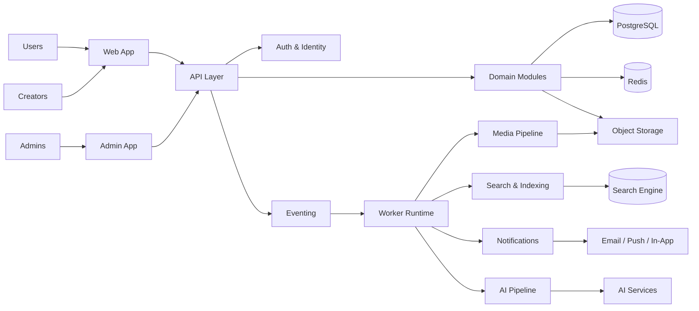

Decision explanation:

- users and creators interact through dedicated client applications
- the API layer orchestrates requests and emits events
- workers handle long-running and side-effect-driven tasks
- storage and indexing concerns are externalized from domain modules

## 4. Context Diagram

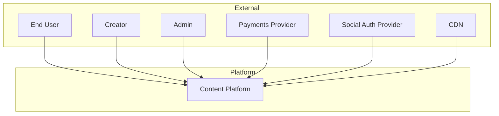

Decision explanation:

- the system is modeled as a single platform boundary with clearly defined external dependencies
- third-party authentication and payment providers are treated as integration points, not core platform components
- CDN is treated as an edge delivery layer that improves performance and reduces origin load

## 5. Container Diagram

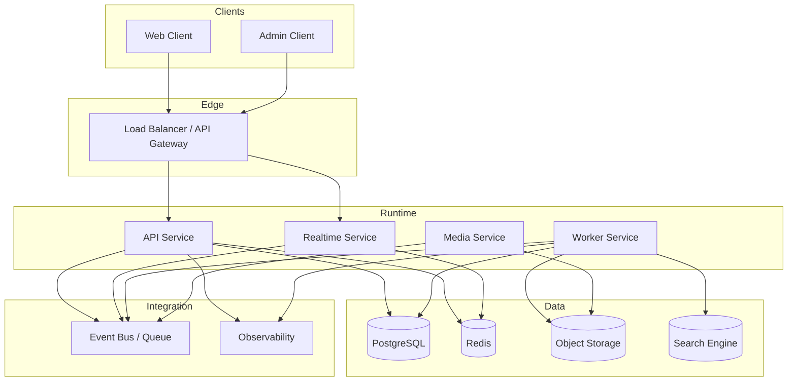

Decision explanation:

- each runtime concern is separated by responsibility
- real-time traffic is isolated from request processing
- media processing is isolated to a dedicated service boundary
- the system remains a single deployment unit in the first phase while keeping runtime separation clear

## 6. Component Diagram

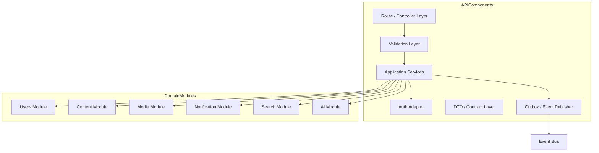

Decision explanation:

- the API layer stays thin and orchestration-focused
- domain modules expose application-facing boundaries rather than being reached directly from controllers
- outbox-style event publication keeps domain state changes and side effects aligned

## 7. Module Diagram

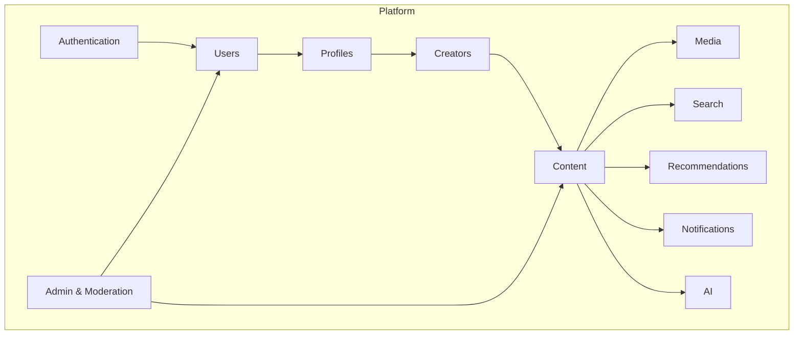

Decision explanation:

- the system is organized around business capabilities rather than technical layers
- each module owns a domain slice and exposes narrow contracts
- cross-module collaboration is explicit and event-driven

## 8. Package Diagram

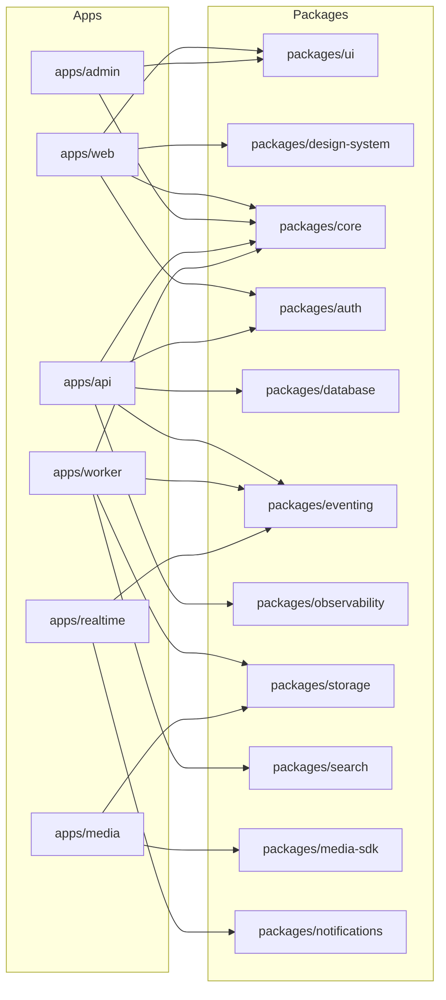

Decision explanation:

- runtime apps depend on platform packages rather than each other
- platform packages carry reusable capabilities and infrastructure abstractions
- the dependency model keeps implementation details out of the application layer

## 9. Deployment Diagram

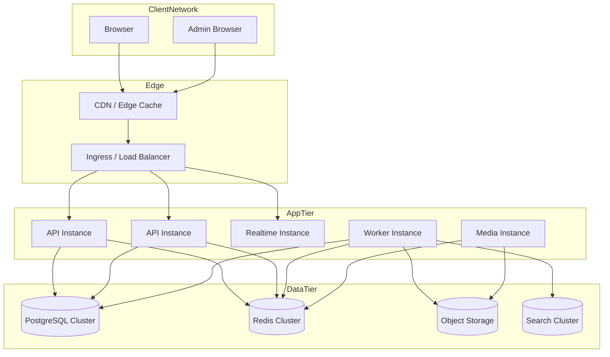

Decision explanation:

- a CDN and ingress layer improve delivery and security early
- application services can scale independently in later phases
- data services remain centralized initially, which keeps complexity low

## 10. Event Flow Diagram

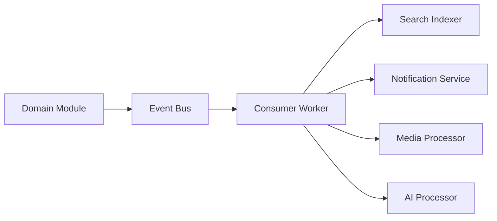

Decision explanation:

- domain modules emit facts, not direct commands to every downstream system
- downstream systems subscribe to events and act independently
- this is the core enabler for future decomposition

## 11. Request Flow Diagram

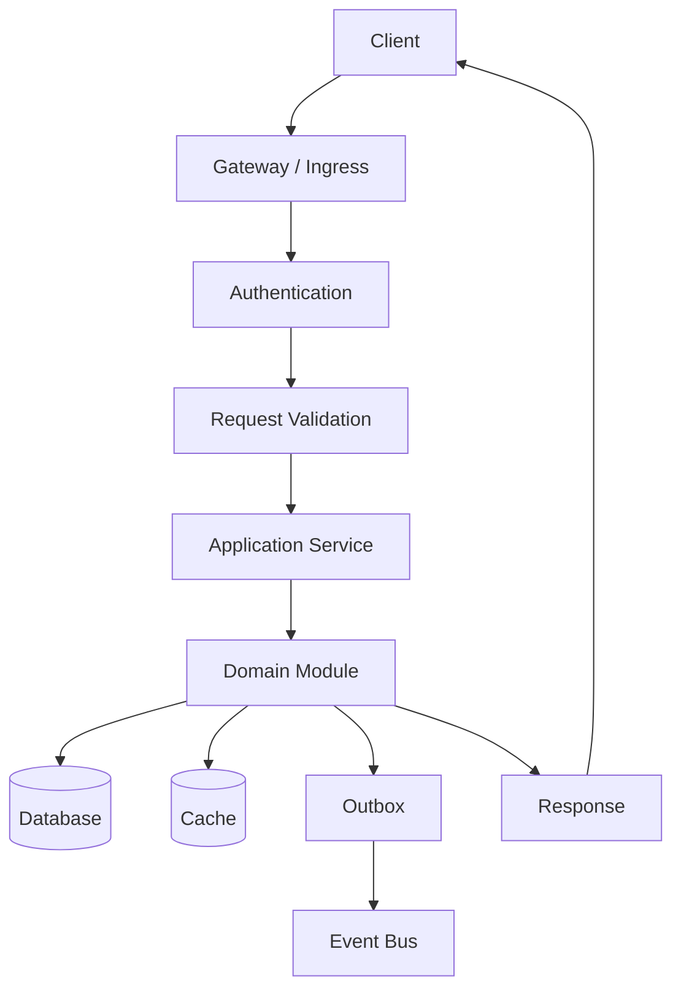

Decision explanation:

- request processing is explicit and deterministic
- side effects are emitted after the transactional write so the system remains traceable
- every stage is observable and easy to instrument

## 12. Authentication Flow

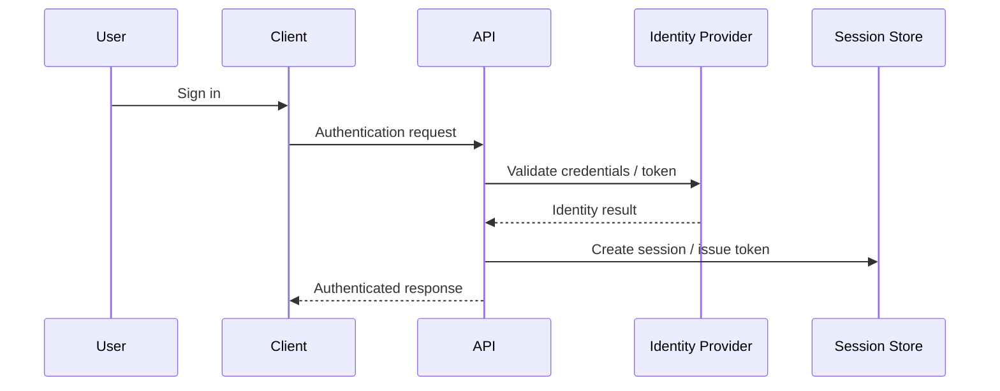

Decision explanation:

- authentication is isolated as a platform capability
- identity providers are integrated through adapters rather than embedded into domain logic
- sessions and tokens remain centralized and replaceable

## 13. Upload Flow

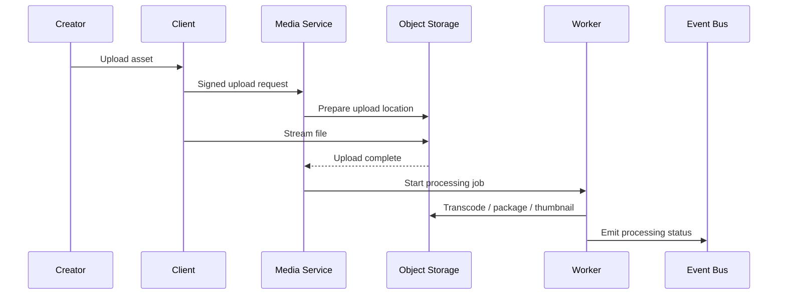

Decision explanation:

- uploads are decoupled from the main request path through a dedicated media service
- storage remains durable and externalized
- processing occurs asynchronously so uploads do not block the experience

## 14. Streaming Flow

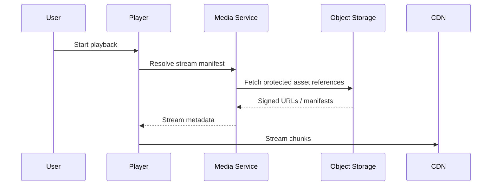

Decision explanation:

- streaming is optimized through a dedicated media path and edge delivery
- the architecture isolates origin access from client playback experience
- this keeps the platform ready for adaptive bitrate and live streaming

## 15. Search Flow

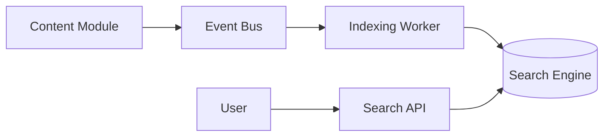

Decision explanation:

- search is treated as a first-class capability with its own indexing pipeline
- content changes are indexed asynchronously to avoid coupling search to write requests
- search remains replaceable and can be scaled independently

## 16. Recommendation Flow

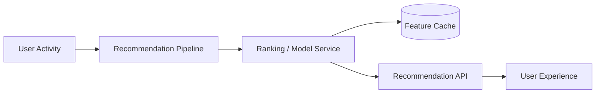

Decision explanation:

- recommendation logic is isolated from the main domain path
- the pipeline can consume signals from events and user actions without coupling the core domain to ranking logic
- this makes experimentation and model updates manageable

## 17. Notification Flow

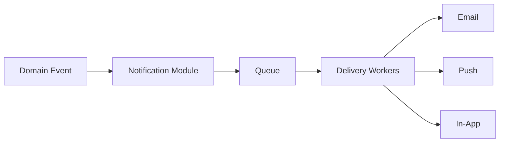

Decision explanation:

- notifications are treated as a side-effect capability with asynchronous delivery
- the delivery layer can evolve independently without changing the producing modules
- this keeps the user experience responsive while ensuring delivery guarantees

## 18. AI Pipeline

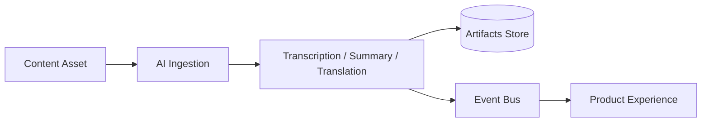

Decision explanation:

- AI capabilities are isolated as background processors rather than embedded inside domain services
- generated artifacts are stored separately because they are derived data, not primary content
- this enables experimentation and model swapping without affecting the core domain

## 19. Media Pipeline

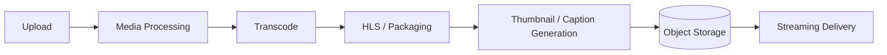

Decision explanation:

- media is handled as a specialized pipeline with distinct stages
- the pipeline is intentionally asynchronous and storage-centric
- this makes adaptive streaming and future codec support easier

## 20. Creator Workflow

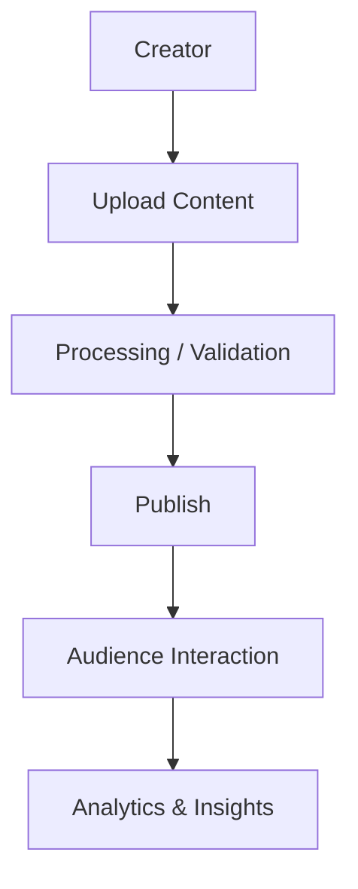

Decision explanation:

- the workflow is centered on the creator as the primary producer of content
- publishing and analytics are separated so creator operations are not blocked by downstream processing
- the flow supports future dashboard and monetization capabilities without redesign

## 21. User Workflow

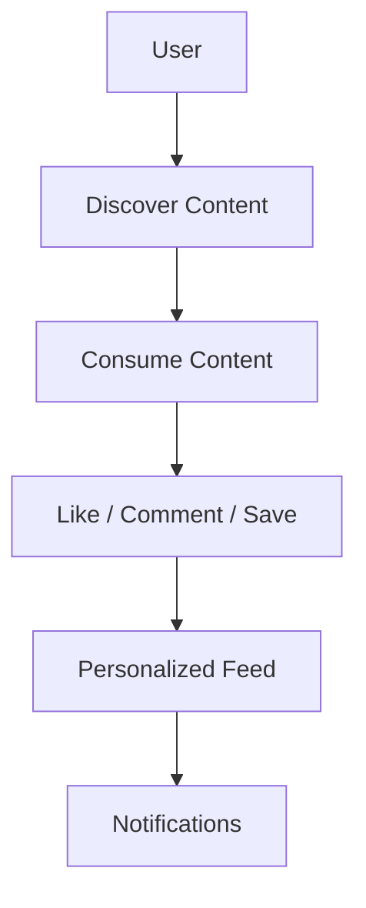

Decision explanation:

- the user experience is modeled as a sequence of discovery, consumption, and feedback loops
- personalization and notifications are connected through events rather than direct coupling
- this creates a platform that can support rich engagement over time

## 22. Why This Architecture Is Better Than a Traditional Layered Architecture

A traditional layered architecture often becomes a hierarchy of broad services where each layer knows too much about the others. That causes:

- tight coupling between presentation and business rules
- difficulty changing one capability without affecting others
- poor horizontal scalability for media, search, and notifications
- slower time to market when new features are added

This architecture is better because:

- modules own their own domain and data boundaries
- the core is composed of explicit capabilities, not broad shared layers
- asynchronous integration reduces blocking and increases resilience
- new capabilities can be added without forcing the entire system to change shape
- the system can evolve toward microservices without re-architecting from scratch

## 23. Why Modular Monolith Is the Right First Step

A modular monolith is chosen because it is the most practical way to balance speed, discipline, and future growth.

Benefits:

- one deployable unit for the initial product
- simpler operations than a distributed system
- easier testing and debugging
- strong architectural boundaries that are visible in code
- clear migration targets for future service extraction

## 24. How It Can Later Become Microservices

The architecture is intentionally designed so that modules can be extracted when they become independently valuable.

A practical path is:

1. keep the modular monolith as the initial deployment unit
2. identify modules with high traffic, independent scaling needs, or different operational requirements
3. extract them behind stable contracts and event interfaces
4. move their data ownership and deployment independently
5. preserve the shared platform packages and observability model

Good candidates for extraction first:

- media processing
- search indexing
- recommendations
- notifications
- realtime interaction
- AI pipelines

This approach avoids a premature distributed architecture while preserving the ability to split the platform later when needed.

## 25. Summary

This architecture is a pragmatic middle path:

- modular enough to stay maintainable
- event-driven enough to stay extensible
- monolithic enough to remain operationally simple
- service-ready enough to evolve without an architectural rewrite

It is designed not just for shipping the first version, but for sustaining a multi-year product roadmap.
