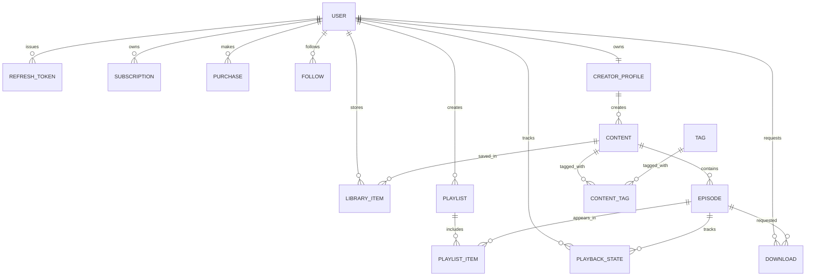
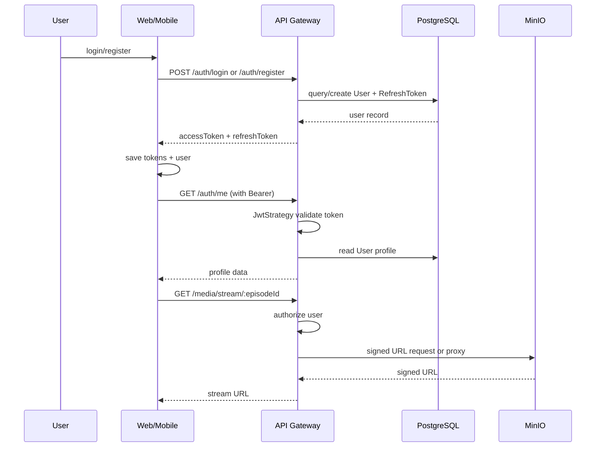

PROJECT_AUDIT_2026-07-12_FA

## استخراج ساختار Repository و فناوری‌های استفاده‌شده (بر اساس فایل‌های واقعی مخزن)

### 1) ساختار Repository و Workspace
- ریشه مخزن شامل فایل‌های اصلی زیر است:
  - package.json: تعریف Monorepo root، اسکریپت‌های build/test/lint/dev و وابستگی‌های عمومی.
  - pnpm-workspace.yaml: تعریف Workspaceها شامل apps/*، packages/* و services/*.
  - turbo.json: تعریف task graph برای generate/build/typecheck/lint/test/clean/dev با وابستگی بین پروژه‌ها.
  - tsconfig.base.json: تنظیمات TypeScript پایه برای کل Monorepo.
  - prisma.config.ts: پیکربندی Prisma برای schema در packages/database/prisma/schema.prisma.
  - docker-compose.yml: تعریف زیرساخت محلی با PostgreSQL، Redis و MinIO.
  - README.md: مستندات راه‌اندازی و ساختار Monorepo.

- ساختار Workspaceها از روی فایل‌های واقعی این‌گونه است:
  - apps/web: اپ وب Next.js.
  - apps/mobile: اپ موبایل React Native با Expo.
  - packages/database: پکیج Prisma و Client.
  - packages/shared: پکیج اشتراکی برای types/constants.
  - packages/ui-tokens: پکیج توکن‌های UI.
  - services/api-gateway: سرویس NestJS API Gateway.

### 2) ساختار پوشه‌ای دقیق
- Root-level:
  - apps/: شامل اپ‌های وب و موبایل.
  - packages/: شامل پکیج‌های database، shared و ui-tokens.
  - services/: شامل سرویس api-gateway.
  - docs/: مستندات پروژه.
  - docker-compose.yml: زیرساخت Docker.
  - prisma.config.ts: پیکربندی Prisma.
  - turbo.json: orchestrator task runner.

- apps/web:
  - package.json: تعریف Next.js، React، Zustand و اسکریپت‌های build/dev/lint/test.
  - next.config.js: پیکربندی Next.js و transpilePackages.
  - src/app/: ساختار اپ Router Next.js.
  - src/components/: اجزای UI.
  - src/lib/: API client، onboarding، recent search و ابزارهای کمکی.
  - src/store/: Zustand store برای player.
  - scripts/a11y-check.mjs: اسکریپت accessibility check.

- apps/mobile:
  - package.json: تعریف Expo، React Native، Expo Router، Secure Store و Zustand.
  - app.json: پیکربندی Expo و پلاگین‌های لازم.
  - babel.config.js: پیکربندی Babel برای Expo.
  - metro.config.js: پیکربندی Metro bundler.
  - app/: مسیرهای Expo Router (login/register/tabs/content/video).
  - components/: کامپوننت‌های React Native.
  - lib/: storage/API helpers و utilityها.
  - store/: Zustand store برای player.
  - context/: contextهای React.

- packages/database:
  - prisma/schema.prisma: مدل‌های Prisma و datasource PostgreSQL.
  - prisma/seed.ts: seed script.
  - generated/: output Prisma client.

- packages/shared:
  - src/index.ts: تایپ‌ها و ثابت‌های اشتراکی مانند AuthTokens، JwtPayload، API_PREFIX.

- packages/ui-tokens:
  - src/: توکن‌های UI.

- services/api-gateway:
  - package.json: تعریف NestJS، Swagger، Passport، JWT، Throttler، Prisma، Redis، AWS S3 SDK.
  - src/main.ts: bootstrap NestJS، Swagger، ValidationPipe و listen روی پورت.
  - src/app.module.ts: ثبت ماژول‌های اصلی، ConfigModule، ThrottlerModule، PrismaModule، RedisModule، StorageModule و guards.
  - src/modules/: ماژول‌های auth/content/media/user/payment/health.
  - src/common/: Prisma، Redis، Storage و guards/utilities.
  - test/: تست‌های integration/unit.

### 3) فناوری‌های استفاده‌شده و محل استفاده

- TypeScript
  - استفاده شده در: package.json، tsconfig.base.json، apps/web/tsconfig.json، apps/mobile/tsconfig.json، services/api-gateway/tsconfig.json و همه فایل‌های src/.
  - چرا استفاده شده: زبان اصلی برای پیاده‌سازی Monorepo، اپ‌ها و سرویس‌ها.

- Node.js
  - استفاده شده در: package.json (engines و scripts) و اسکریپت‌های Node در apps/web/scripts و services/api-gateway/scripts.
  - چرا استفاده شده: runtime برای ابزارهای Monorepo، build scripts و اجرای سرویس‌ها.

- pnpm
  - استفاده شده در: package.json و pnpm-workspace.yaml.
  - چرا استفاده شده: package manager و Workspace manager برای Monorepo.

- TurboRepo / Turborepo
  - استفاده شده در: turbo.json و package.json.
  - چرا استفاده شده: task orchestration برای build/test/lint/dev در چند pakage/app/service.

- React
  - استفاده شده در: apps/web/package.json و apps/web/src/**/*.tsx.
  - چرا استفاده شده: برای رابط کاربری وب.

- Next.js
  - استفاده شده در: apps/web/package.json و apps/web/next.config.js.
  - چرا استفاده شده: framework وب برای اپ وب و SSR/CSR patterns.

- React Native
  - استفاده شده در: apps/mobile/package.json و apps/mobile/app/*.tsx و components/.
  - چرا استفاده شده: برای اپ موبایل.

- Expo
  - استفاده شده در: apps/mobile/package.json، apps/mobile/app.json، apps/mobile/babel.config.js و apps/mobile/metro.config.js.
  - چرا استفاده شده: tooling و runtime برای ساخت/اجرا/توسعه اپ موبایل.

- Expo Router
  - استفاده شده در: apps/mobile/app/_layout.tsx، apps/mobile/app/(tabs)/_layout.tsx، apps/mobile/app/login.tsx، apps/mobile/app/register.tsx و سایر فایل‌های app/.
  - چرا استفاده شده: routing برای اپ موبایل.

- Zustand
  - استفاده شده در: apps/web/src/store/player.ts و apps/mobile/store/player.ts.
  - چرا استفاده شده: state management برای player و auth state.

- NestJS
  - استفاده شده در: services/api-gateway/package.json، services/api-gateway/src/main.ts، services/api-gateway/src/app.module.ts و ماژول‌های src/modules/.
  - چرا استفاده شده: framework بک‌اند برای API Gateway.

- Express
  - استفاده شده در: services/api-gateway/package.json (وابستگی @nestjs/platform-express).
  - چرا استفاده شده: زیرساخت HTTP runtime برای NestJS.

- Swagger / OpenAPI
  - استفاده شده در: services/api-gateway/src/main.ts.
  - چرا استفاده شده: مستندسازی API و ارائه docs در مسیر /docs.

- ValidationPipe و class-validator / class-transformer
  - استفاده شده در: services/api-gateway/src/main.ts و services/api-gateway/src/modules/auth/auth.dto.ts.
  - چرا استفاده شده: اعتبارسنجی ورودی‌های API.

- Prisma ORM
  - استفاده شده در: packages/database/package.json، packages/database/prisma/schema.prisma، services/api-gateway/src/common/prisma/prisma.service.ts.
  - چرا استفاده شده: ORM برای دسترسی به PostgreSQL و تعریف مدل‌های دیتابیس.

- PostgreSQL
  - استفاده شده در: docker-compose.yml و packages/database/prisma/schema.prisma.
  - چرا استفاده شده: دیتابیس اصلی پروژه.

- Redis
  - استفاده شده در: docker-compose.yml و services/api-gateway/src/common/redis/redis.service.ts.
  - چرا استفاده شده: برای cache و ذخیره‌سازی状態‌های موقت/کَش با ioredis.

- MinIO / S3-compatible storage
  - استفاده شده در: docker-compose.yml و services/api-gateway/src/common/storage/storage.service.ts.
  - چرا استفاده شده: ذخیره رسانه و ساخت signed upload URL برای آپلود فایل.

- JWT Authentication
  - استفاده شده در: services/api-gateway/src/modules/auth/auth.service.ts، services/api-gateway/src/modules/auth/jwt.strategy.ts و services/api-gateway/src/modules/auth/auth.module.ts.
  - چرا استفاده شده: احراز هویت برای API و محافظت از مسیرها.

- Passport
  - استفاده شده در: services/api-gateway/src/modules/auth/jwt.strategy.ts و services/api-gateway/src/modules/auth/auth.module.ts.
  - چرا استفاده شده: integration با استراتژی‌های احراز هویت در NestJS.

- bcryptjs
  - استفاده شده در: services/api-gateway/src/modules/auth/auth.service.ts.
  - چرا استفاده شده: هش کردن پسوردها.

- AWS SDK for S3
  - استفاده شده در: services/api-gateway/package.json و services/api-gateway/src/common/storage/storage.service.ts.
  - چرا استفاده شده: تعامل با سرویس S3-compatible برای آپلود و signed URL.

- Jest
  - استفاده شده در: services/api-gateway/package.json، services/api-gateway/jest.config.js، apps/mobile/package.json و تست‌های services/api-gateway/test/.
  - چرا استفاده شده: تست unit/integration.

- ts-jest
  - استفاده شده در: services/api-gateway/jest.config.js و apps/mobile/jest.config.js.
  - چرا استفاده شده: اجرای تست‌های TypeScript با Jest.

- Supertest
  - استفاده شده در: services/api-gateway/test/*.spec.ts.
  - چرا استفاده شده: تست HTTP integration روی NestJS app.

- ESLint
  - استفاده شده در: eslint.config.mjs، apps/web/eslint.config.mjs، apps/mobile/eslint.config.js و package.json scripts.
  - چرا استفاده شده: linting کد.

- Prettier
  - استفاده شده در: .prettierrc.json و package.json scripts در ریشه و زیرپکیج‌ها.
  - چرا استفاده شده: format code.

- Docker Compose
  - استفاده شده در: docker-compose.yml.
  - چرا استفاده شده: راه‌اندازی سرویس‌های دیتابیس، cache و object storage محلی.

- Expo Secure Store
  - استفاده شده در: apps/mobile/lib/storage.ts و apps/mobile/context/ThemeContext.tsx.
  - چرا استفاده شده: ذخیره امن توکن/تنظیمات در موبایل.

### 4) Build / Run / CI-CD
- اسکریپت‌های build/run اصلی از package.json ریشه:
  - dev: turbo run dev
  - build: turbo run build
  - typecheck: turbo run typecheck
  - test: turbo run test
  - lint: turbo run lint
  - db:generate / db:migrate / db:seed
  - docker:up / docker:down
- اسکریپت‌های سرویس/اپ نیز در فایل‌های package.json هر Workspace تعریف شده‌اند، از جمله:
  - apps/web: next dev/build/start/lint/test.
  - apps/mobile: expo start/build/test/lint.
  - services/api-gateway: nest build/start/test/lint.
- فایل پیکربندی CI/CD مانند GitHub Actions، GitLab CI یا Jenkinsfile در مخزن یافت نشد؛ بنابراین وجود CI/CD قابل اثبات نیست.

### 5) فناوری‌های قابل‌اثبات نیست
- هر فناوری جدیدی که خارج از فایل‌های ذکرشده در این سند وجود نداشته باشد، قابل اثبات نیست.
- نمونه‌هایی که در این مخزن قابل اثبات نیستند:
  - GraphQL یا gRPC به‌صورت صریح در فایل‌های این مخزن.
  - Kafka/RabbitMQ/SQS یا Event Bus به‌صورت صریح در فایل‌های این مخزن.
  - OAuth Provider غیر از Passport/JWT و Google OAuth package که در package.json مشاهده شد.

## تحلیل کاربردی پروژه بر اساس کد و مستندات موجود (2026-07-12)

### 1) این پروژه چیست؟
- این مخزن یک Monorepo است که یک «Super App رسانه‌ای» برای پادکست، کتاب صوتی و ویدیو طراحی کرده است. این ادعا از [README.md](README.md)، [docs/ARCHITECTURE.md](docs/ARCHITECTURE.md) و [package.json](package.json) قابل استناد است.
- در سطح معماری، یک اپ وب، یک اپ موبایل، یک API Gateway NestJS و یک پکیج دیتابیس Prisma در کنار زیرساخت Docker برای PostgreSQL/Redis/MinIO تعریف شده است. این ساختار در [package.json](package.json)، [pnpm-workspace.yaml](pnpm-workspace.yaml)، [docker-compose.yml](docker-compose.yml) و [services/api-gateway/src/app.module.ts](services/api-gateway/src/app.module.ts) دیده می‌شود.

### 2) چه مشکلی حل می‌کند؟
- مشکل اصلی که این پروژه به‌نظر حل می‌کند، ادغام کشف محتوا، پخش، ادامه گوش دادن، کتابخانه و مدیریت دسترسی در یک تجربه واحد برای کاربر است. این موضوع در [docs/ARCHITECTURE.md](docs/ARCHITECTURE.md)، [docs/API.md](docs/API.md) و [apps/mobile/app/(tabs)/index.tsx](apps/mobile/app/(tabs)/index.tsx) دیده می‌شود.
- مشکل دوم، فراهم کردن مسیرهای تولید محتوا برای سازنده است: ایجاد محتوا، افزودن اپیزود، انتشار و آپلود رسانه. این مسیرها در [services/api-gateway/src/modules/content/content.service.ts](services/api-gateway/src/modules/content/content.service.ts)، [services/api-gateway/src/modules/content/content.controller.ts](services/api-gateway/src/modules/content/content.controller.ts) و [apps/web/src/app/(main)/creator/page.tsx](apps/web/src/app/(main)/creator/page.tsx) پیاده‌سازی شده‌اند.

## معماری کامل پروژه

### 1) دید کلی Monorepo
- ریشه پروژه در `package.json` و `pnpm-workspace.yaml` به عنوان Monorepo تعریف شده است.
- سه حوزه اصلی وجود دارد:
  - `apps/`: اپلیکیشن‌های کلاینت شامل `apps/web` (Next.js) و `apps/mobile` (Expo React Native).
  - `services/`: سرویس بک‌اند `services/api-gateway` (NestJS API Gateway).
  - `packages/`: بسته‌های مشترک شامل `@castaminofen/shared`، `@castaminofen/ui-tokens` و `@castaminofen/database`.
- زیرساخت محلی با `docker-compose.yml` شامل PostgreSQL، Redis و MinIO تعریف شده است.

### 2) Dependency Graph
```mermaid
flowchart LR
  Root[Monorepo root]
  Web[apps/web]
  Mobile[apps/mobile]
  ApiGateway[services/api-gateway]
  Shared[@castaminofen/shared]
  UiTokens[@castaminofen/ui-tokens]
  DatabasePkg[@castaminofen/database]
  Postgres[PostgreSQL]
  Redis[Redis]
  MinIO[MinIO/S3]

  Root --> Web
  Root --> Mobile
  Root --> ApiGateway
  Root --> Shared
  Root --> UiTokens
  Root --> DatabasePkg

  Web --> Shared
  Web --> UiTokens
  Mobile --> Shared
  Mobile --> UiTokens
  ApiGateway --> Shared
  ApiGateway --> DatabasePkg

  ApiGateway --> Postgres
  ApiGateway --> Redis
  ApiGateway --> MinIO
```

### 3) مرز ماژول‌ها
- `apps/web`: رابط کاربری وب، رندر صفحات، صفحه ورود/ثبت‌نام، کاوش، محتوا، کتابخانه، سازنده و پلیر.
- `apps/mobile`: رابط کاربری موبایل با Expo Router، مدیریت auth محلی، پخش و همگام‌سازی وضعیت.
- `services/api-gateway`: API REST اصلی با ماژول‌های NestJS برای auth، content، media، user، payment و health.
- `packages/shared`: انواع مشخص، ثابت‌ها و قراردادهای API مشترک بین سرویس و کلاینت.
- `packages/ui-tokens`: توکن‌های طراحی مشترک برای وب و موبایل.
- `packages/database`: Prisma ORM، تعریف schema و client برای دسترسی به دیتابیس.

### 4) سبک معماری
- سبک اصلی: Monorepo با جداسازی client و server.
- Backend: API Gateway pattern با NestJS و معماری ماژولار.
- سرویس‌ها: RESTful endpoints و لایه‌بندی controller -> service -> persistence.
- کلاینت: SPA برای وب و اپ موبایل هیبرید با Expo، با state management محلی و ارتباط API.
- ذخیره‌سازی حاصل: Postgres برای داده اصلی، Redis برای کش/حالت موقت و MinIO برای رسانه.

### 5) API Flow
- مسیرهای اصلی:
  - `POST /auth/register`, `POST /auth/login`, `POST /auth/refresh`, `GET /auth/me`, `PATCH /auth/me`
  - `GET /trending`, `GET /explore`, `GET /search`, `GET /contents/:id`, `GET /episodes/:id`, `GET /contents/:id/related`
  - `POST /creator/contents`, `POST /creator/contents/:id/episodes`, `POST /creator/contents/:id/publish`
  - `POST /creator/media/upload-url`, `POST /creator/media/upload`
  - `GET /media/stream/:episodeId`, `POST /media/playback/:episodeId`, `GET /media/continue`, `POST /media/download/:episodeId`, `GET /media/downloads`
  - `POST /user/follow/:creatorId`, `DELETE /user/follow/:creatorId`, `GET /user/following`
  - `POST /user/library/:contentId`, `DELETE /user/library/:contentId`, `GET /user/library`
  - `POST /user/playlists`, `GET /user/playlists`, `GET /user/playlists/:id`, `POST /user/playlists/:id/items`
  - `GET /payment/plans`, `GET /payment/subscription`, `POST /payment/subscribe/:plan`, `POST /payment/verify`, `POST /payment/purchase/:contentId`, `POST /payment/purchase/verify`

- در کلاینت وب:
  - `apps/web/src/lib/http.ts` و `apps/web/src/lib/api.ts` فراخوانی‌ها را به `API_URL` ارسال می‌کنند.
  - `apps/web/src/store/player.ts` توکن‌ها را نگه می‌دارد و refresh خودکار را مدیریت می‌کند.
- در کلاینت موبایل:
  - `apps/mobile/lib/api.ts` و `apps/mobile/lib/apiUrl.ts` مسیر پایه را محاسبه و درخواست‌ها را به `API_URL` ارسال می‌کنند.
  - `apps/mobile/store/player.ts` توکن‌ها را با `expo-secure-store` نگهداری می‌کند.

### 6) Database Flow
- `packages/database/prisma/schema.prisma` مدل‌های داده اصلی و روابط را تعریف می‌کند.
- مدل‌های کلیدی:
  - `User`: حساب کاربر، رمز عبور هش شده، نقش، locale، avatar.
  - `CreatorProfile`: پروفایل سازنده و ارتباط یک‌به‌یک با `User`.
  - `Content` و `Episode`: محتوای رسانه‌ای و اپیزودها.
  - `Subscription`, `Purchase`, `RefreshToken`: مدیریت اشتراک و پرداخت.
  - `LibraryItem`, `Playlist`, `PlaylistItem`: ذخیره و دسته‌بندی محتوا.
  - `PlaybackState`: همگام‌سازی موقعیت پخش و وضعیت دستگاه.
  - `Download`: ثبت دانلودهای کاربر.
  - `Follow`: دنبال کردن سازندگان.
  - `Tag`, `ContentTag`: برچسب‌گذاری محتوا.



### 7) Auth Flow
- ثبت‌نام و ورود با `services/api-gateway/src/modules/auth/auth.service.ts` انجام می‌شود.
- `AuthService.register()` و `AuthService.login()`:
  - جستجوی کاربر بر اساس ایمیل در `User`.
  - هش کردن رمز عبور با `bcryptjs`.
  - ایجاد `refreshToken` با `crypto.randomBytes`.
  - تولید JWT با `JwtService` و ذخیره `RefreshToken` در دیتابیس.
- محافظت مسیرها توسط `JwtStrategy`, `GlobalAuthGuard` و دکوراتور `@Auth()` انجام می‌شود.
- `@Public()` مسیرهایی مانند ورود و ثبت‌نام را از محافظت خارج می‌کند.
- کلاینت وب و موبایل:
  - توکن‌ها در state و storage محلی ذخیره می‌شوند.
  - `rawFetch` در صورت `401` سعی می‌کند `refreshSession()` را فراخوانی کند.
  - اگر refresh منجر به خطا شود، کاربر logout می‌شود.



### 8) State Flow
- `apps/web/src/store/player.ts` از `zustand` با `persist` برای نگهداری طول عمر کوتاه auth و بعضی از state های پخش استفاده می‌کند.
- `apps/mobile/store/player.ts` از `zustand` با ذخیره‌سازی دستی `expo-secure-store` برای `accessToken`, `refreshToken`, `user` استفاده می‌کند.
- state های کلیدی:
  - `accessToken`, `refreshToken`, `user`, `authReady`
  - `currentEpisode`, `streamUrl`, `isPlaying`, `position`, `playbackSpeed`, `sleepTimerEnd`
  - mobile: `playerSheetExpanded`, `isBookmarked`
- جریان state:
  - پس از ورود/ثبت‌نام، `setAuth()` مقداردهی مقادیر auth را انجام می‌دهد.
  - `hydrateProfile()` پروفایل را از `/auth/me` می‌گیرد و state کاربر را به‌روز می‌کند.
  - در صورت `401`، `refreshSession()` توکن جدید می‌گیرد و دوباره درخواست را تکرار می‌کند.
  - `logout()` همه مقادیر auth و پخش را ریست می‌کند.

### 9) جریان داده‌های مهم
- پخش رسانه:
  - کاربر با محتوا تعامل می‌کند، اپیزود را انتخاب می‌کند و `apiFetch('/media/stream/:episodeId')` را فراخوانی می‌کند.
  - API Gateway `MediaService` URL امضا شده تولید می‌کند.
  - کلاینت با `streamUrl` پخش را آغاز می‌کند.
  - `POST /media/playback/:episodeId` موقعیت پخش را در `PlaybackState` ذخیره می‌کند.
- کتابخانه و دنبال‌شدن:
  - `GET /user/library` و `GET /user/following` داده‌های ذخیره شده را از `UserService` می‌گیرد.
  - `POST /user/library/:contentId` و `POST /user/follow/:creatorId` حالت کاربر را در دیتابیس به‌روزرسانی می‌کند.
- پرداخت و اشتراک:
  - `GET /payment/plans` برنامه‌های اشتراک را باز می‌گرداند.
  - `POST /payment/subscribe/:plan` و `POST /payment/purchase/:contentId` فرآیند ایجاد خرید/اشتراک را شروع می‌کنند.

### 10) نکات طراحی
- `@castaminofen/shared` به عنوان قرارداد API و مدل‌های ساده بین کلاینت و سرور استفاده می‌شود.
- backend بر پایه NestJS ماژولار است و هر حوزه جداگانه در ماژول مخصوص خود قرار دارد.
- `packages/database` با Prisma client یک لایه persistence واحد فراهم می‌کند.
- `docker-compose.yml` زیرساخت دیتابیس، کش و ذخیره رسانه را فراهم کرده است؛ این نشان می‌دهد که پروژه برای توسعه محلی با سرویس‌های مستقل طراحی شده است.
- کلاینت موبایل از `resolveApiUrl()` استفاده می‌کند تا در Expo Go و وب آدرس مناسب API را کشف کند.

### نتیجه‌گیری
این پروژه یک Monorepo قابل توسعه است که مرزهای مشخصی میان UI وب، اپ موبایل، API Gateway و لایه دیتابیس دارد. معماری ترکیبی آن شامل RESTful backend، JWT auth، state محلی روی کلاینت، و ذخیره رسانه‌ای با MinIO است.

- مشکل سوم، اعمال کنترل دسترسی برای محتوای پریمیوم و خرید/اشتراک است. این قابلیت در [services/api-gateway/src/modules/media/media.service.ts](services/api-gateway/src/modules/media/media.service.ts) و [services/api-gateway/src/modules/payment/payment.service.ts](services/api-gateway/src/modules/payment/payment.service.ts) وجود دارد، اما در بخشی از آن‌ها به‌صورت stub باقی مانده است.

### 3) کاربران این پروژه چه کسانی هستند؟
- کاربر عادی/مصرف‌کننده: کسی که محتوا را می‌بیند، جستجو می‌کند، پخش می‌کند، در کتابخانه نگه می‌دارد و از ادامه گوش دادن استفاده می‌کند. این نقش در [packages/database/prisma/schema.prisma](packages/database/prisma/schema.prisma) و UIهای [apps/web/src/app/(main)/content/[id]/page.tsx](apps/web/src/app/(main)/content/[id]/page.tsx) و [apps/mobile/app/content/[id].tsx](apps/mobile/app/content/[id].tsx) نمایان است.
- سازنده/بدست‌آورنده محتوا: کسی که محتوا ایجاد می‌کند، اپیزود می‌افزاید، رسانه آپلود می‌کند و محتوا را منتشر می‌کند. این نقش در [services/api-gateway/src/modules/content/content.service.ts](services/api-gateway/src/modules/content/content.service.ts) و [apps/web/src/components/CreatorContentCard.tsx](apps/web/src/components/CreatorContentCard.tsx) دیده می‌شود.
- مدیر: نقش ADMIN در سیستم احراز هویت و کنترل دسترسی وجود دارد و در [services/api-gateway/src/modules/auth/auth.service.ts](services/api-gateway/src/modules/auth/auth.service.ts) و [services/api-gateway/src/modules/content/content.controller.ts](services/api-gateway/src/modules/content/content.controller.ts) استفاده شده است.

### 4) چه قابلیت‌هایی به‌صورت کامل/پیاده‌سازی‌شده وجود دارند؟
- احراز هویت و نقش‌ها: ثبت‌نام، ورود، refresh token، پروفایل کاربر و ایجاد subscription اولیه برای کاربر در [services/api-gateway/src/modules/auth/auth.service.ts](services/api-gateway/src/modules/auth/auth.service.ts) پیاده‌سازی شده‌اند.
- کاوش و جستجو: مسیرهای explore، trending، search، related content و جزئیات محتوا/اپیزود در بک‌اند و همچنین صفحات وب/موبایل برای نمایش آنها وجود دارد؛ شواهد در [services/api-gateway/src/modules/content/content.service.ts](services/api-gateway/src/modules/content/content.service.ts)، [services/api-gateway/src/modules/content/content.controller.ts](services/api-gateway/src/modules/content/content.controller.ts)، [apps/web/src/app/(main)/page.tsx](apps/web/src/app/(main)/page.tsx) و [apps/mobile/app/(tabs)/search.tsx](apps/mobile/app/(tabs)/search.tsx).
- پخش رسانه و ادامه گوش دادن: سرویس stream، playback sync، continue listening و دانلود در بک‌اند موجود است؛ این‌ها در [services/api-gateway/src/modules/media/media.service.ts](services/api-gateway/src/modules/media/media.service.ts) و [services/api-gateway/src/modules/media/media.controller.ts](services/api-gateway/src/modules/media/media.controller.ts) دیده می‌شوند.
- کارکردهای اجتماعی و شخصی‌سازی اولیه: follow، library، playlist و نمایش وضعیت آن‌ها در [services/api-gateway/src/modules/user/user.service.ts](services/api-gateway/src/modules/user/user.service.ts) و UIهای [apps/web/src/app/(main)/content/[id]/page.tsx](apps/web/src/app/(main)/content/[id]/page.tsx) و [apps/mobile/app/content/[id].tsx](apps/mobile/app/content/[id].tsx) وجود دارد.

### 11) تحلیل عملکرد و UX

#### Performance
- Bundle Size / Lazy Loading:
  - وب: هیچ‌کدام از صفحات یا کامپوننت‌های سنگین به صورت `next/dynamic` یا `React.lazy` تفکیک نشده‌اند. فایل‌هایی مانند `apps/web/src/components/Nav.tsx`, `apps/web/src/components/ThemeProvider.tsx`, `apps/web/src/app/(main)/search/SearchClient.tsx` و صفحات محتوا تمام خروجی را در بسته اصلی قرار می‌دهند.
  - موبایل: Expo bundle از lazy loading صفحه‌ای استفاده نمی‌کند و `apps/mobile/app/(tabs)/index.tsx` و `apps/mobile/app/(tabs)/library.tsx` از `ScrollView`/`FlatList` معمولی استفاده می‌کنند. این می‌تواند باعث افزایش اندازه اولیه و مصرف حافظه در اپ شود.
  - تصاویر وب: `apps/web/src/components/CoverImage.tsx` به صورت بومی `loading="lazy"` دارد که مفید است، ولی کمبود lazy loading در لود صفحات و مودال‌ها باقی می‌ماند.

- Caching:
  - بک‌اند: `services/api-gateway/src/common/redis/redis.service.ts` سرویس Redis را فراهم می‌کند اما در `services/api-gateway/src/modules/content/content.service.ts` و اکثر سرویس‌های دیگر هیچ کشی روی نتایج `findMany` یا queryهای سنگین اعمال نشده است.
  - health cache: `services/api-gateway/src/modules/health/health.controller.ts` تنها برای بررسی اتصال Redis استفاده می‌شود و نه برای کش کردن پاسخ‌های محتوایی.

- N+1 Queries:
  - `services/api-gateway/src/modules/content/content.service.ts` در متدهایی مانند `getTrending`, `getRelated`, `explore` و `getContent` از `include` برای بارگذاری creator، user و episodes استفاده می‌کند، که مفید است، اما متد `search` سه query مجزا اجرا می‌کند و روی بار سرور فشار وارد می‌کند.
  - `services/api-gateway/src/modules/user/user.service.ts` برخی از `findUnique` و `findMany`های جداگانه را در جریان `follow`، `library` و `playlist` اجرا می‌کند؛ اگر اینها بعداً در لایه نمایش با mapهای اضافی ترکیب شوند، ممکن است به N+1 query تبدیل شوند.

- Indexes:
  - Prisma schema ایندکس‌های اصلی روی `@unique` دارد: `User.email`, `CreatorProfile.userId`, `CreatorProfile.slug`, `Content.slug`, `Episode.slug`, `Tag.name`, `Purchase.gatewayRef` و چند ترکیب unique برای `Follow`, `LibraryItem`, `PlaylistItem`, `PlaybackState`, `Download`.
  - اما ایندکس‌های مناسب برای فیلترهای پرکاربرد در `Content` روی `status`, `type`, `publishedAt`، و ترکیب `creatorId` یا `contentId` در `Episode` وجود ندارد. این موضوع در `packages/database/prisma/schema.prisma` مشهود است.
  - درخواست‌های `findMany` با شرط بر `status`، `publishedAt`، `type` و همچنین `episode.content` می‌توانند از ایندکس‌های اضافی بهره ببرند.

- Re-render / Memory Usage:
  - وب: کامپوننت‌های زیادی `useState`, `useEffect` و `useCallback` دارند، اما در بسیاری از موارد `React.memo` یا memoization برای لیست‌های طولانی استفاده نشده است. این موضوع در `apps/web/src/components/CreatorContentCard.tsx`, `apps/web/src/app/(main)/search/SearchClient.tsx`, `apps/web/src/components/PlayerBar.tsx` و `apps/web/src/components/ExploreGrid.tsx` دیده می‌شود.
  - موبایل: `apps/mobile/app/(tabs)/index.tsx` از `ScrollView` برای محتوای اصلی استفاده می‌کند و این می‌تواند وقتی تعداد آیتم‌ها زیاد شود باعث افزایش مصرف حافظه و رندر بیشتر شود. `FlatList` برای لیست افقی استفاده می‌شود، اما لیست‌های عمودی طولانی‌تر در صفحات دیگر بدون virtualization کامل باقی می‌مانند.
  - استایل‌های تم موبایل با `useThemedStyles` بازسازی می‌شوند که در صورت تغییر رنگ یا props ممکن است محاسبه مکرر داشته باشد و مصرف CPU/HW را افزایش دهد.

#### UX
- Navigation:
  - وب: `apps/web/src/components/Nav.tsx` ناوبری اصلی را با `Link` فراهم می‌کند و از `aria-current` استفاده شده است. مسیرهای اصلی و پنل سازنده به خوبی جدا شده‌اند.
  - موبایل: `apps/mobile/app/_layout.tsx`, `apps/mobile/app/(tabs)/_layout.tsx` و `apps/mobile/components/TabletTabRail.tsx` ساختار تب و استک را پوشش می‌دهند. اما `router.push` در تعداد زیادی `TouchableOpacity` استفاده شده است که ممکن است پیگیری مسیر کاربری را دشوار کند.

- Accessibility:
  - وب: aria labels، role و alert در `apps/web/src/components/ErrorBanner.tsx`, `apps/web/src/components/EmptyState.tsx`, `apps/web/src/components/PaywallModal.tsx`, `apps/web/src/components/Nav.tsx` و `apps/web/src/components/ProgressBar.tsx` پیاده‌سازی شده‌اند.
  - موبایل: اکتیویتی بار، `accessibilityRole`, `accessibilityLabel` در `apps/mobile/components/ErrorBanner.tsx`, `apps/mobile/components/EmptyState.tsx`, `apps/mobile/components/PlayerBottomSheet.tsx`, `apps/mobile/components/SectionHeader.tsx` و `apps/mobile/components/PlayerCoachMark.tsx` وجود دارد.
  - نکته: در وب، مدیریت فوکوس در مودال‌ها و بازگشت به عنصر فعال قبلی بررسی نشده است. در موبایل نیز اندازه‌ی ناحیه‌های قابل لمس و خوانایی در حالت‌های تضاد بالاتر باید بررسی بیشتر شود.

- Dark Mode:
  - وب: `apps/web/src/components/ThemeProvider.tsx` و `apps/web/src/components/ThemeScript.tsx` تم را روی `document.documentElement` اعمال می‌کنند. حالت پیش‌فرض `dark` است و تشخیص خودکار سیستم به‌صورت صریح پیاده نشده است.
  - موبایل: `apps/mobile/app/_layout.tsx`, `apps/mobile/app/(tabs)/_layout.tsx` و `apps/mobile/context/ThemeContext.tsx` تم را از طریق `useAppTheme` و `useThemedStyles` به کامپوننت‌ها می‌رسانند. تجربهٔ تاریک/روشن در UI موبایل به‌نظر پوشش داده شده است.

- Loading / Empty / Error States:
  - هر دو پلتفرم از `Skeleton`, `EmptyState` و `ErrorBanner` استفاده می‌کنند. فایل‌های قابل اشاره:
    - وب: `apps/web/src/components/Skeleton.tsx`, `apps/web/src/components/EmptyState.tsx`, `apps/web/src/components/ErrorBanner.tsx`, `apps/web/src/app/(main)/search/loading.tsx`
    - موبایل: `apps/mobile/components/Skeleton.tsx`, `apps/mobile/components/EmptyState.tsx`, `apps/mobile/components/ErrorBanner.tsx`
  - در عین حال، بعضی صفحات مانند `apps/web/src/components/CreatorContentCard.tsx` فقط یک پیام متنی بارگذاری دارند و لودینگ یکپارچه‌تری ندارند.

- Mobile Experience:
  - اپ موبایل با Expo Router و Tab Navigation ساخته شده است و نماهای مناسب تبلت در `apps/mobile/components/TabletSplitView.tsx` و `apps/mobile/components/TabletTabRail.tsx` در دسترس است.
  - با این حال، بخش‌های `apps/mobile/app/(tabs)/index.tsx` و `apps/mobile/app/(tabs)/library.tsx` می‌توانند در دستگاه‌های ضعیف‌تر با محتوای طولانی سریع‌تر به مشکل برخورد کنند؛ زیرا محتوای عمودی به صورت `ScrollView` یا `FlatList` با تعداد محدود render شده است.
  - تجربهٔ بارگذاری و خطا روی موبایل نسبتاً بالغ است، ولی لازم است UX تعاملی برای شبکه‌های ضعیف‌تر و fallbackهای صوتی/تصویری بیشتر تقویت شود.

- پنل سازنده و چرخه آپلود/انتشار: ایجاد محتوا، افزودن اپیزود، انتشار و آپلود رسانه در وب وجود دارد؛ شواهد در [apps/web/src/app/(main)/creator/page.tsx](apps/web/src/app/(main)/creator/page.tsx)، [apps/web/src/components/CreatorContentCard.tsx](apps/web/src/components/CreatorContentCard.tsx) و [apps/web/src/components/EpisodeUploadForm.tsx](apps/web/src/components/EpisodeUploadForm.tsx).

### 5) چه قابلیت‌هایی ناقص یا نیمه‌کاره‌اند؟
- پرداخت واقعی: در [services/api-gateway/src/modules/payment/payment.service.ts](services/api-gateway/src/modules/payment/payment.service.ts) مسیرهای subscribe/purchase وجود دارد اما با کدهای stub و پیام‌های «integrate Zarinpal in production» باقی مانده‌اند. در [docs/ARCHITECTURE.md](docs/ARCHITECTURE.md) و [docs/ROADMAP.md](docs/ROADMAP.md) نیز این موضوع به‌عنوان stub مشخص شده است.
- جستجو و کشف محتوا: جستجو در سطح کد بر پایه contains و فیلترهای ساده است، نه موتور full-text یا semantic search. این محدودیت در [services/api-gateway/src/modules/content/content.service.ts](services/api-gateway/src/modules/content/content.service.ts) و [docs/TECH-DECISIONS.md](docs/TECH-DECISIONS.md) مشهود است.
- کنترل دسترسی و DRM: مسیرهای stream/download برای محتوای پریمیوم وجود دارد، اما در کد از signed URL ساده و stub پرداخت استفاده شده است؛ این موضوع در [services/api-gateway/src/modules/media/media.service.ts](services/api-gateway/src/modules/media/media.service.ts) و [services/api-gateway/src/modules/storage/storage.service.ts](services/api-gateway/src/common/storage/storage.service.ts) دیده می‌شود.
- پشتیبانی‌های پیشرفته و AI: ASR، خلاصه‌سازی، پیشنهادات شخصی‌سازی‌شده و ویژگی‌های AI در [docs/ROADMAP.md](docs/ROADMAP.md) به‌عنوان فاز ۲/۳ آمده‌اند و در کد فعلی قابل اثبات نیستند.

### 6) چه قابلیت‌هایی رها شده‌اند یا فقط اسکلت هستند؟
- ویژگی‌های پرداخت و درگاه واقعی در کد فعلی رها شده‌اند؛ فقط مسیر API و منطق اولیه وجود دارد. شواهد در [services/api-gateway/src/modules/payment/payment.service.ts](services/api-gateway/src/modules/payment/payment.service.ts) و [docs/ROADMAP.md](docs/ROADMAP.md).
- ویژگی‌های Desktop و E2E test در برنامه‌ریزی فاز ۲ آمده‌اند اما در مخزن فعلی پیاده‌سازی نشده‌اند. شواهد در [docs/ROADMAP.md](docs/ROADMAP.md) و [docs/TECH-DECISIONS.md](docs/TECH-DECISIONS.md).
- در رابط موبایل صفحه ویدیو، بخش‌هایی مانند «اشتراک»، «دانلود»، «نظر» و «اپیزودهای دیگر» فقط UI هستند و عملکرد واقعی ندارند. این مورد در [apps/mobile/app/video/[id].tsx](apps/mobile/app/video/[id].tsx) دیده می‌شود.
- در بخش‌های UI برخی ابزارها و placeholders به‌صورت non-functional باقی مانده‌اند که نشان می‌دهد پروژه هنوز در مرحله MVP/Prototype است و نه محصول نهایی. نمونه در [apps/mobile/app/video/[id].tsx](apps/mobile/app/video/[id].tsx) و [docs/product-growth-roadmap.md](docs/product-growth-roadmap.md).

### 7) جمع‌بندی کوتاه
- این پروژه در حال حاضر یک MVP/Prototype با هسته‌ی واقعی برای کشف محتوا، پخش، احراز هویت، پنل سازنده و کارکردهای اجتماعی اولیه است. این ادعا بر اساس [README.md](README.md)، [docs/ROADMAP.md](docs/ROADMAP.md)، [services/api-gateway/src/modules/content/content.service.ts](services/api-gateway/src/modules/content/content.service.ts) و صفحات وب/موبایل مرتبط است.
- اما چندین قابلیت مهم برای «استفاده واقعی در تولید» هنوز ناقص، stub یا فقط اسکلت‌اند؛ مهم‌ترین آن‌ها پرداخت واقعی، AI/ASR/recommendation، full-text search و برخی تعامل‌های UI در صفحه‌های خاص هستند.

## تحلیل پوشه‌های اصلی پروژه

### 1) پوشه ریشه پروژه
- هدف: فراهم کردن چارچوب مرکزی Monorepo و هماهنگی بین اپ‌ها، سرویس‌ها و پکیج‌های مشترک.
- وظیفه: تعریف Workspace، اسکریپت‌های مشترک، تنظیمات TypeScript، مدیریت Prisma و زیرساخت Docker برای محیط توسعه.
- فایل‌های مهم: [package.json](package.json)، [pnpm-workspace.yaml](pnpm-workspace.yaml)، [turbo.json](turbo.json)، [tsconfig.base.json](tsconfig.base.json)، [prisma.config.ts](prisma.config.ts)، [docker-compose.yml](docker-compose.yml)، [README.md](README.md).
- وابستگی‌ها: pnpm/TurboRepo، Docker، Node.js، Prisma، ابزارهای lint/test/build.
- نقاط ضعف: کمبود CI/CD، نبود الگوی مدیریت محیط متغیرها و تنظیمات اطمینان از کیفیت مرکزی، و وابستگی زیاد اسکریپت‌های ریشه به ساختار داخلی پروژه.
- پیشنهاد بهبود: افزودن template محیط‌سازی، CI با lint/typecheck/test، و یک فایل راهنمای توسعه‌ی استاندارد برای همه اعضای تیم.

### 2) پوشه apps
- هدف: نگه‌داشتن کلاینت‌های نهایی پروژه برای وب و موبایل.
- وظیفه: ارائه تجربه کاربری، تعامل با API، مدیریت state محلی، پخش رسانه و نمایش مسیرهای اصلی کسب‌وکار.
- فایل‌های مهم: [apps/web](apps/web)، [apps/mobile](apps/mobile)، [apps/web/package.json](apps/web/package.json)، [apps/mobile/package.json](apps/mobile/package.json)، [apps/web/src](apps/web/src)، [apps/mobile/app](apps/mobile/app).
- وابستگی‌ها: [packages/shared](packages/shared)، [packages/ui-tokens](packages/ui-tokens)، [services/api-gateway](services/api-gateway)، Zustand، Next.js، Expo و React Native.
- نقاط ضعف: تکرار منطق میان وب و موبایل، احتمال ناهم‌گونی در تجربه کاربری و پراکندگی منطق کسب‌وکار در کامپوننت‌ها.
- پیشنهاد بهبود: ایجاد لایه‌ی shared business logic و shared UI kit، استانداردسازی state management و کاهش تکرار در کامپوننت‌ها.

### 3) پوشه packages
- هدف: تبدیل بخش‌های مشترک به واحدهای قابل استفاده در کل Monorepo.
- وظیفه: نگهداری قراردادهای مشترک، توکن‌های طراحی، مدل‌های دیتابیس و ابزارهای مشترک که در چند اپ و سرویس استفاده می‌شوند.
- فایل‌های مهم: [packages/shared](packages/shared)، [packages/shared/src/index.ts](packages/shared/src/index.ts)، [packages/database](packages/database)، [packages/database/prisma/schema.prisma](packages/database/prisma/schema.prisma)، [packages/ui-tokens](packages/ui-tokens).
- وابستگی‌ها: Prisma، TypeScript، ابزارهای build و سرویس‌های وب/موبایل.
- نقاط ضعف: پکیج‌های مشترک هنوز به‌صورت محدود توسعه یافته‌اند و لایه‌ی پایگاه‌داده با سرویس API تا حدی به هم نزدیک است.
- پیشنهاد بهبود: تفکیک بیشتر دامنه‌های business logic، افزایش تست خودکار برای پکیج‌ها و ایجاد نسخه‌گذاری روشن برای بسته‌های اشتراکی.

### 4) پوشه services
- هدف: ارائه هسته‌ی بک‌اند و منطق اصلی سیستم.
- وظیفه: مدیریت احراز هویت، محتوا، رسانه، کاربر، پرداخت و دسترسی به داده‌ها از طریق API Gateway.
- فایل‌های مهم: [services/api-gateway](services/api-gateway)، [services/api-gateway/src/app.module.ts](services/api-gateway/src/app.module.ts)، [services/api-gateway/src/main.ts](services/api-gateway/src/main.ts)، [services/api-gateway/src/modules](services/api-gateway/src/modules)، [services/api-gateway/src/common](services/api-gateway/src/common).
- وابستگی‌ها: [packages/database](packages/database)، PostgreSQL، Redis، MinIO/S3-compatible storage، JWT، Passport، Swagger.
- نقاط ضعف: برخی ماژول‌ها هنوز در سطح اسکلت یا stub قرار دارند، پیچیدگی رشد‌یافته در سرویس و نیاز به تست‌های یکپارچه‌تر و نظارت بهتر بر خطاها.
- پیشنهاد بهبود: تقویت معماری ماژولار، اضافه کردن تست integration/contract برای API، و استانداردسازی error handling و observability.

### 5) پوشه docs
- هدف: مستندسازی معماری، روند توسعه، تصمیمات فنی و مسیر رشد محصول.
- وظیفه: انتقال دانش بین اعضای تیم، مستندسازی API و فرآیندهای توسعه، و ثبت roadmap پروژه.
- فایل‌های مهم: [docs/ARCHITECTURE.md](docs/ARCHITECTURE.md)، [docs/API.md](docs/API.md)، [docs/ROADMAP.md](docs/ROADMAP.md)، [docs/TECH-DECISIONS.md](docs/TECH-DECISIONS.md)، [docs/project-audit](docs/project-audit).
- وابستگی‌ها: کد پروژه، خروجی‌های تحلیل و تصمیمات تیم.
- نقاط ضعف: مستندات ممکن است با کد فعلی دچار drift شوند و پیوند بین مستندات و کد به‌صورت خودکار برقرار نباشد.
- پیشنهاد بهبود: استفاده از docs-as-code، اتوماتیک‌سازی هم‌سازسازی مستندات با تغییرات کد و افزودن checklist برای انتشار قابلیت‌ها.

### جدول وضعیت Feature‌های اصلی پروژه

| Feature | توضیح | فایل‌های مرتبط | Dependencyها | درصد تکمیل | وضعیت | کمبودها | مشکلات | اولویت | ریسک توسعه |
|---|---|---|---|---:|---|---|---|---|---|
| احراز هویت و پروفایل کاربر | ثبت‌نام، ورود، refresh token، نمایش پروفایل و نقش‌های کاربر | [services/api-gateway/src/modules/auth/auth.service.ts](services/api-gateway/src/modules/auth/auth.service.ts), [services/api-gateway/src/modules/auth/auth.controller.ts](services/api-gateway/src/modules/auth/auth.controller.ts), [apps/web/src/app/login/page.tsx](apps/web/src/app/login/page.tsx), [apps/mobile/app/login.tsx](apps/mobile/app/login.tsx) | NestJS, JWT, Passport, Prisma, PostgreSQL | 85% | عملی و پایدار | MFA، بازیابی رمز، audit log، refresh rotation قوی | پیچیدگی نگهداری توکن و هماهنگی بین وب/موبایل | P0 | متوسط |
| کاوش و جستجو محتوا | نمایش Trending، Explore، Search و Related Content | [services/api-gateway/src/modules/content/content.service.ts](services/api-gateway/src/modules/content/content.service.ts), [services/api-gateway/src/modules/content/content.controller.ts](services/api-gateway/src/modules/content/content.controller.ts), [apps/web/src/app/(main)/page.tsx](apps/web/src/app/(main)/page.tsx), [apps/mobile/app/(tabs)/search.tsx](apps/mobile/app/(tabs)/search.tsx) | Prisma, PostgreSQL, API Gateway, UI clients | 75% | نیمه‌کاره/عملی | full-text search، فیلترهای پیشرفته، semantic search | جستجو بر پایه منطق ساده و محدود است | P1 | متوسط |
| پخش رسانه و Continue Listening | پخش صوت/ویدیو، sync وضعیت پخش و ادامه گوش دادن | [services/api-gateway/src/modules/media/media.service.ts](services/api-gateway/src/modules/media/media.service.ts), [services/api-gateway/src/modules/media/media.controller.ts](services/api-gateway/src/modules/media/media.controller.ts), [apps/web/src/store/player.ts](apps/web/src/store/player.ts), [apps/mobile/store/player.ts](apps/mobile/store/player.ts) | MinIO/S3, Redis, Player UI, API Gateway | 80% | عملی در هسته | حالت آفلاین، adaptive quality، DRM، resume conflict handling | وابستگی به سرویس رسانه و کیفیت پخش | P0 | بالا |
| کتابخانه، دنبال‌کردن و پلی‌لیست | ذخیره محتوا، دنبال کردن سازنده و مدیریت پلی‌لیست | [services/api-gateway/src/modules/user/user.service.ts](services/api-gateway/src/modules/user/user.service.ts), [packages/database/prisma/schema.prisma](packages/database/prisma/schema.prisma), [apps/web/src/app/(main)/content/[id]/page.tsx](apps/web/src/app/(main)/content/[id]/page.tsx) | Prisma, PostgreSQL, Auth, Content module | 70% | عملی ولی محدود | همگام‌سازی بین دستگاه‌ها، پلی‌لیست اشتراکی، اشتراک‌گذاری | منطق کاربری و UI هنوز ساده است | P1 | متوسط |
| پنل سازنده و چرخه انتشار محتوا | ساخت محتوا، افزودن اپیزود، آپلود رسانه و انتشار | [apps/web/src/app/(main)/creator/page.tsx](apps/web/src/app/(main)/creator/page.tsx), [apps/web/src/components/EpisodeUploadForm.tsx](apps/web/src/components/EpisodeUploadForm.tsx), [services/api-gateway/src/modules/content/content.service.ts](services/api-gateway/src/modules/content/content.service.ts) | Auth, Storage, Content module, Prisma | 78% | عملی در سطح MVP | مدیریت پیش‌نویس، اعتبارسنجی رسانه، workflow review، moderation | وابستگی به UX و storage stability | P1 | متوسط |
| آپلود رسانه و Storage | ساخت signed URL، بارگذاری فایل و دسترسی به رسانه | [services/api-gateway/src/common/storage/storage.service.ts](services/api-gateway/src/common/storage/storage.service.ts), [services/api-gateway/src/modules/media/media.service.ts](services/api-gateway/src/modules/media/media.service.ts), [docker-compose.yml](docker-compose.yml) | MinIO/S3, API Gateway, Media module | 70% | عملی ولی پایه‌ای | chunk upload، resume، virus scan، thumbnail generation | نیاز به بهینه‌سازی برای حجم بالای رسانه | P1 | بالا |
| پرداخت و اشتراک | پلن‌ها، خرید محتوا، اشتراک و verify پرداخت | [services/api-gateway/src/modules/payment/payment.service.ts](services/api-gateway/src/modules/payment/payment.service.ts), [services/api-gateway/src/modules/payment/payment.controller.ts](services/api-gateway/src/modules/payment/payment.controller.ts), [docs/ROADMAP.md](docs/ROADMAP.md) | Payment provider, Billing logic, Auth, Prisma | 35% | اسکلت/Stub | ادغام زارین‌پال، webhook، refund، tax، مجوز دسترسی واقعی | پرداخت واقعی هنوز کامل نیست | P0 | بالا |
| تجربه موبایل و UI/UX | اپ موبایل، پلیر، تب‌ها، onboarding و تجربه کاربری | [apps/mobile/app](apps/mobile/app), [apps/mobile/components](apps/mobile/components), [apps/mobile/context](apps/mobile/context) | Expo, React Native, API client, Zustand | 72% | عملی در MVP | هم‌خوانی UI با وب، تست روی دستگاه‌های واقعی، accessibility | تکرار منطق و drift در UI بین پلتفرم‌ها | P1 | متوسط |
| آنالیتیکس و بینش سازنده | رویدادهای کاربر، شاخص‌های بازدید، گزارش سازنده | [docs/ROADMAP.md](docs/ROADMAP.md), [services/api-gateway/src/modules/content/content.service.ts](services/api-gateway/src/modules/content/content.service.ts) | Event pipeline, DB, Analytics dashboards | 20% | در فاز برنامه‌ریزی | جمع‌آوری رویداد، داشبورد، retention، cohort | نبود زیرساخت رویداد و ابزار تحلیل | P2 | بالا |
| AI/ASR/Recommendation | رونویسی، خلاصه‌سازی، پیشنهاد شخصی‌سازی‌شده و جست‌وجوی داخل صوت | [docs/ROADMAP.md](docs/ROADMAP.md), [docs/TECH-DECISIONS.md](docs/TECH-DECISIONS.md) | AI models, transcript pipeline, vector DB/embedding | 10% | مفهوم‌محور و در برنامه | دیتاست فارسی، مدل ASR، هزینه اجرا، دیتابیس embedding | نیاز به سرمایه‌گذاری و راه‌اندازی معماری AI | P2 | بسیار بالا |

## تحلیل smell‌های کد و معماری (2026-07-12)

### 1) Dead Code / Unused Files / Packages / Components
- موارد مشکوک به dead code یا low-value runtime artifacts:
  - [apps/mobile/lib/onboarding.test.ts](apps/mobile/lib/onboarding.test.ts) — فایل تستی در مسیر lib که در جریان runtime اپ استفاده نمی‌شود و بیشتر به عنوان artifact آزمایشی دیده می‌شود.
  - [apps/mobile/components/PlayerCoachMark.tsx](apps/mobile/components/PlayerCoachMark.tsx) — یک کمک‌UI تک‌منظوره که فقط در یک نقطه به کار می‌رود و به‌نظر می‌رسد می‌توان آن را در همان parent component ادغام کرد.
  - [packages/database/generated](packages/database/generated) — کدهای تولیدشده Prisma حجم زیادی دارند و به‌جای منبع کد تألیف‌شده، بیشتر به عنوان artifact build/engine عمل می‌کنند.

### 2) Duplicate Code
- [apps/web/src/store/player.ts](apps/web/src/store/player.ts) و [apps/mobile/store/player.ts](apps/mobile/store/player.ts) منطق مشابهی برای auth state، token persistence و player state دارند.
- الگوی صفحه‌ی اصلی در [apps/web/src/app/(main)/page.tsx](apps/web/src/app/(main)/page.tsx) و [apps/mobile/app/(tabs)/index.tsx](apps/mobile/app/(tabs)/index.tsx) از نظر ساختار UI و fetch داده مشابه است و در دو پلتفرم تکرار شده است.

### 3) God Components / Classes
- [apps/mobile/components/PlayerBottomSheet.tsx](apps/mobile/components/PlayerBottomSheet.tsx) چند مسئولیت را در خود دارد: animation، gesture handling، state UI، controls، haptics، routing و presentation.
- [apps/mobile/app/(tabs)/index.tsx](apps/mobile/app/(tabs)/index.tsx) هم زمان data fetching، state loading، UI section، continue-listening، category list و routing را مدیریت می‌کند.
- [services/api-gateway/src/modules/content/content.service.ts](services/api-gateway/src/modules/content/content.service.ts) هم‌زمان listing، search، related-content، create، formatting و pagination را پوشش می‌دهد.

### 4) Large Functions / Files
- [apps/mobile/app/(tabs)/search.tsx](apps/mobile/app/(tabs)/search.tsx) — حدود 474 خط.
- [apps/mobile/app/(tabs)/index.tsx](apps/mobile/app/(tabs)/index.tsx) — حدود 364 خط.
- [apps/mobile/components/PaywallModal.tsx](apps/mobile/components/PaywallModal.tsx) — حدود 341 خط.
- [apps/mobile/components/PlayerBottomSheet.tsx](apps/mobile/components/PlayerBottomSheet.tsx) — حدود 333 خط.
- [services/api-gateway/src/modules/content/content.service.ts](services/api-gateway/src/modules/content/content.service.ts) — حدود 295 خط.

### 5) Circular Dependencies
- در اسکن استاتیک، چرخه‌ی مستقیم import در main source tree دیده نشد، اما وابستگی‌های نزدیک و تکرارشونده بین [apps/mobile/app/(tabs)/_layout.tsx](apps/mobile/app/(tabs)/_layout.tsx)، [apps/mobile/components/PlayerBottomSheet.tsx](apps/mobile/components/PlayerBottomSheet.tsx)، [apps/mobile/components/MiniPlayer.tsx](apps/mobile/components/MiniPlayer.tsx) و [apps/mobile/store/player.ts](apps/mobile/store/player.ts) نشانه‌ی افزایش coupling و احتمال چرخه در آینده است.
- در وب نیز [apps/web/src/app/(main)/content/[id]/page.tsx](apps/web/src/app/(main)/content/[id]/page.tsx)، [apps/web/src/components/PaywallModal.tsx](apps/web/src/components/PaywallModal.tsx) و [apps/web/src/components/RelatedContentSection.tsx](apps/web/src/components/RelatedContentSection.tsx) به‌صورت نزدیک به هم وابسته‌اند.

### 6) Magic Numbers
- [apps/mobile/components/PlayerBottomSheet.tsx](apps/mobile/components/PlayerBottomSheet.tsx) مقادیر سخت‌کدشده‌ای مثل 72، 0.92، 0.85، 0.55، 40 و 60 دارد.
- [apps/mobile/app/(tabs)/index.tsx](apps/mobile/app/(tabs)/index.tsx) در استایل‌ها و layout از اعداد سخت‌کدشده مانند 260، 56، 6 و 8 استفاده می‌کند.

### 7) Weak Typing
- [services/api-gateway/src/modules/content/content.service.ts](services/api-gateway/src/modules/content/content.service.ts) از cast‌های `as never` برای type/status استفاده می‌کند که typing را ضعیف‌تر می‌کند.
- [services/api-gateway/src/modules/payment/payment.service.ts](services/api-gateway/src/modules/payment/payment.service.ts) از `plan as never` و stringly-typed status values استفاده می‌کند.
- [apps/mobile/lib/api.ts](apps/mobile/lib/api.ts) با `Record<string, unknown>` و `RequestInit` کار می‌کند و قرارداد API را به‌صورت ضمنی نگه می‌دارد.

### 8) High Coupling
- [apps/mobile/app/(tabs)/index.tsx](apps/mobile/app/(tabs)/index.tsx) با API، theme، store، layout hooks، router و چند کامپوننت UI در یک‌جا درگیر است.
- [apps/mobile/components/PlayerBottomSheet.tsx](apps/mobile/components/PlayerBottomSheet.tsx) به store، audio engine، router، haptics، animation و theme به‌طور مستقیم وابسته است.
- [services/api-gateway/src/modules/content/content.service.ts](services/api-gateway/src/modules/content/content.service.ts) مستقیماً به Prisma، Redis، DTO و response util وابسته است.

### 9) Code / Architecture Smells
- لایه‌ی UI هنوز به‌صورت screen-as-orchestrator عمل می‌کند و صفحه‌ها به‌جای اینکه view شفاف باشند، منطق کسب‌وکار و orchestration را هم انجام می‌دهند.
- بین وب و موبایل در ساختار featureها تکرار و drift وجود دارد که نگهداری و هماهنگی را سخت می‌کند.
- مسیرهای پرداخت و دسترسی به محتوای Premium هنوز به‌صورت stub/placeholder باقی مانده‌اند و در قالب service‌های domain-encapsulated کامل نشده‌اند.

### 10) TODO / FIXME / HACK
- [services/api-gateway/src/modules/payment/payment.service.ts](services/api-gateway/src/modules/payment/payment.service.ts) دارای comments روشن برای stub integration و verification است.
- [packages/database/generated/runtime/library.d.ts](packages/database/generated/runtime/library.d.ts) در generated Prisma runtime دارای TODOهاست.
- فایل‌های runtime و main bootstrap مثل [services/api-gateway/src/main.ts](services/api-gateway/src/main.ts) همچنان خروجی debug/console دارند که برای production باید حذف شوند.

### 11) Commented Code
- [packages/database/generated/index.d.ts](packages/database/generated/index.d.ts) شامل بلوک‌های commented-out و نمونه‌های commented در داخل declarations تولیدشده Prisma است.
- [packages/database/generated/runtime/library.d.ts](packages/database/generated/runtime/library.d.ts) و [packages/database/generated/index.d.ts](packages/database/generated/index.d.ts) از نظر ساختار و comments بسیار شلوغ‌اند و مانع خوانایی می‌شوند.

# Security Audit Addendum (Authentication / Authorization / JWT / Secrets / Validation / Injection / XSS / CSRF / Upload / Rate Limiting / API Security)

This section is appended as a targeted security review of the current repository state on 2026-07-12.

## 1) Authentication and Authorization

- services/api-gateway/src/modules/auth/auth.module.ts
  - High: JWT secret default fallback to `dev-secret` when `JWT_SECRET` is missing.
  - High: `JWT_EXPIRES_IN` has no validation; if misconfigured it may allow too-long tokens.
  - Medium: no explicit `JWT_ALGORITHM` enforcement; using defaults from `@nestjs/jwt` may be acceptable but stronger to require `HS256`/`RS256` explicitly.
- services/api-gateway/src/modules/auth/jwt.strategy.ts
  - High: JWT token extraction is limited to `Authorization: Bearer` header only. This is acceptable, but there is no check for duplicate or mixed auth headers.
  - Medium: `secretOrKey` fallback to a hard-coded dev secret is insecure in any environment with unconfigured `.env`.
  - Low: validate() returns a user object with limited selection. This is good for least privilege, but additional claims may need to be sanitized.
- services/api-gateway/src/modules/auth/auth.service.ts
  - High: refresh token lifecycle is implemented, but refresh tokens are stored in cleartext in DB.
  - High: refresh token expiration parsing uses `parseInt(process.env.JWT_REFRESH_EXPIRES_IN || '30d', 10)` and will parse `'30d'` incorrectly as `30`, but if a non-numeric string is supplied it may silently degrade to 30 days. Use a dedicated duration parser or numeric-only config.
  - Medium: `issueTokens` returns `expiresIn: 7 * 24 * 60 * 60` hard-coded while actual JWT expiry is from config. This mismatch can make clients believe the token is valid longer/shorter than the server expects.
  - Medium: no refresh token revocation on logout is visible in current code. Session invalidation appears limited to `refresh()` consuming the old refresh token.
  - Medium: no separate claims for token version or session fingerprint to allow forced logout or token rotation on password change.
- services/api-gateway/src/common/decorators/auth.decorator.ts and global guards
  - Medium: `Auth()` uses `AuthGuard('jwt')` and `RolesGuard`; however, `RolesGuard` is also globally provided in AppModule. This is okay, but if roles metadata is missing or stale the guard still checks `user.role` and may return `Forbidden` unexpectedly.
  - Low: `Public()` is a metadata flag but there is no `@UseGuards` fallback for anonymous routes in some edge cases; the global auth guard covers it.
- services/api-gateway/src/modules/content/content.controller.ts
  - High: `@Auth('CREATOR', 'ADMIN')` is applied correctly on creator routes, but `createContent`, `addEpisode`, `publish`, and upload routes rely on `creatorProfile.findUnique({ where: { userId } })` and throw generic `Error('Creator profile required')` in several places. These should be consistent NestJS exceptions (`ForbiddenException`) to avoid stack traces leaking or inconsistent status codes.
  - Medium: routes like `creatorUploadUrl` and `creatorUpload` do not validate ownership of the content or file beyond creator profile presence. This is acceptable for upload metadata, but any post-upload publish flow must ensure the object belongs to the owning creator.

## 2) JWT / Token Handling

- services/api-gateway/src/modules/auth/auth.module.ts
  - High: `JWT_SECRET` must be mandatory; defaulting to `dev-secret` is a critical misconfiguration vulnerability.
  - High: refresh token storage is not hashed. If DB is compromised, refresh tokens can be trivially stolen and reused. Use hashed refresh tokens and compare with a one-way hash.
  - Medium: refresh tokens are stateless per token row, but the code does not show any cleanup job for expired refresh tokens. Orphaned tokens may remain indefinitely.
  - Medium: access token expiry is configured at `JWT_EXPIRES_IN`; without short lifetimes and a refresh token rotation policy, stolen JWTs remain valid until the expiry.
  - Low: there is no explicit token audience or issuer configured for JWT creation/validation.
- services/api-gateway/src/modules/auth/auth.service.ts and auth.controller.ts
  - Medium: `refresh()` deletes the refresh token row on use, which is good. But there is no `refreshToken`/`accessToken` binding to device or IP. This may be acceptable for MVP, but it limits session security.
  - Low: `RefreshTokenDto` only enforces string type, not length or format constraints.
- apps/web and apps/mobile
  - Note: the user asked for audit, but client code is not explicitly reviewed here. The API design suggests bearer token in frontend; if stored in localStorage/sessionStorage or async storage, it may be vulnerable to XSS. Client storage details require separate review.

## 3) Secrets / Env Vars

- services/api-gateway/src/app.module.ts and storage/redis modules
  - High: `ConfigModule.forRoot({ envFilePath: resolve(process.cwd(), '../../.env') })` means `.env` is loaded from repo root relative to `services/api-gateway` rather than a centralized config location. This is fine for local dev, but in production the environment must be supplied externally. Hard-coded path is brittle.
- services/api-gateway/src/modules/auth/auth.module.ts and jwt.strategy.ts
  - High: `JWT_SECRET` fallback to `'dev-secret'` and `JWT_EXPIRES_IN` fallback to `'7d'` represent insecure defaults.
- services/api-gateway/src/common/storage/storage.service.ts
  - High: MinIO `accessKeyId` and `secretAccessKey` default to `minioadmin` / `minioadmin`. This is a serious security issue if the service is deployed with default env values or if the `.env` file is accidentally committed.
  - Medium: `S3_BUCKET`, `S3_ENDPOINT`, `S3_REGION`, `S3_PUBLIC_URL` all have defaults with localhost/minio. This is fine for local dev, but actual production deployment must ensure these are set and not exposed.
- services/api-gateway/src/modules/media/media.service.ts
  - High: `MEDIA_SIGNING_SECRET` falls back to `'dev-media-secret'`. Signed media URLs should use a strong, mandatory secret.
  - Medium: `MEDIA_URL_EXPIRY_SECONDS` fallback to 3600 may be too long for some content depending on threat model.
- services/api-gateway/src/common/redis/redis.service.ts
  - Medium: `REDIS_URL` fallback to `redis://localhost:6379` is acceptable for local dev, but should not be used as default in production deployment.
- services/api-gateway/src/main.ts
  - Low: `API_GATEWAY_PORT` fallback to 3000 is fine.
- General
  - Critical: repository appears to rely on `.env` defaults for several security-sensitive values. There is no evidence of `.env.example` containing production-safe values, nor of a secret management process. This is a major operational risk.

## 4) Validation / Sanitization / Injection

- services/api-gateway/src/main.ts
  - Medium: global `ValidationPipe` is configured with `whitelist: true`, `forbidNonWhitelisted: true`, `transform: true`. This is good for DTO protection, but note it applies only to routes using DTOs.
  - High: there is no global `transformOptions` or `enableImplicitConversion` beyond `transform`, so some numeric query parameters may still be strings unless `@Type(() => Number)` is applied explicitly. That is done in content DTOs, but any missing DTO property elsewhere would be exposed.
- services/api-gateway/src/modules/auth/auth.dto.ts
  - Low: `RegisterDto` validates email and password string, but `displayName` has no regex or length max to prevent overly long name values.
  - Low: `UpdateProfileDto` allows any string for `avatarUrl`; if this is later persisted or returned to clients without sanitization, it could lead to open redirect or reflected XSS in client-side rendering.
- services/api-gateway/src/modules/content/content.dto.ts
  - Medium: search/explore DTOs validate `page` and `limit` as ints and `type` as enum. Good.
  - Medium: `CreateContentDto` and `CreateEpisodeDto` validate values, but `description` and `mediaUrl` strings are not constrained by max length or format. This may allow overly large payloads or unexpected values.
  - Medium: `CreatorUploadUrlDto` validates `fileName` and `contentType` as strings, but there is no content-type whitelist or file extension restriction. This means users can request signed URLs for arbitrary content types.
- services/api-gateway/src/modules/content/content.service.ts
  - Medium: `search()` uses Prisma `contains` with `term = query.q.trim()`. Because Prisma parameterizes the query, raw injection risk is low. However, if the term is empty string or too-long, it may result in expensive database queries; a max length constraint should be enforced.
  - Low: `createContent()` and `addEpisode()` build slugs from user input using regex replacements. This is okay for slug generation, but there is no sanitization on `description`, `title`, or `mediaUrl` beyond `IsString`.
- Prisma usage generally
  - Low: the code uses Prisma query builder methods everywhere and does not appear to use raw SQL or raw queries in the audited files. This provides decent protection against SQL injection.
  - Medium: no explicit protection was found for any future use of `prisma.$queryRaw` or `prisma.$executeRaw`; if added later, those would require careful parameterization.

## 5) Injection (SQL / NoSQL)

- services/api-gateway/src/modules/auth/auth.service.ts
  - Low: uses Prisma `findUnique` and `create` with parameterized values. No raw SQL injection vectors in the auth flow.
- services/api-gateway/src/modules/content/content.service.ts
  - Low: Prisma `findMany`, `findFirst`, `findUnique`, `update`, `create` calls use structured where objects. There is no evidence of raw query injection.
- services/api-gateway/src/modules/media/media.service.ts
  - Low: Prisma calls are parameterized; `episodeId` and `userId` are not used in raw queries.
- services/api-gateway/src/modules/payment/payment.service.ts
  - Low: uses Prisma `findUnique`, `create`, `update` with developer-controlled data, but not raw SQL. No immediate injection.
- Overall
  - Low: the backend uses Prisma ORM consistently, which reduces SQL injection risk. The remaining risk is from any future raw query code or database string interpolation in code not in this review.

## 6) XSS

- apps/web/src/components/ThemeScript.tsx
  - Medium: uses `dangerouslySetInnerHTML` for a theme script. If the `script` string is derived from any user-controlled data, it could cause XSS. The current file likely uses a static script, but it is a pattern that requires review.
- apps/web and apps/mobile
  - Medium: no evidence of server-side rendered HTML templates with unescaped user content. However, the client apps should be audited for places where user-controlled data is rendered into HTML or inserted into `innerHTML`.
- services/api-gateway
  - Low: responses appear JSON-only; XSS risk is primarily on the clients. The API should still ensure data sent back in strings is sanitized if the client renders it unsafely.
- General
  - Medium: no sanitization library is present in the main repo for HTML or markup. If any user-submitted rich text is later added, this is a gap.

## 7) CSRF

- services/api-gateway/src/main.ts
  - Low: no explicit CSRF protection is configured. This is usually acceptable for a JSON API using Bearer tokens in Authorization headers, provided cookies are not used for auth.
  - Medium: `app.enableCors({ origin: true, credentials: true })` with `credentials: true` means the API will accept credentialed requests from any origin if the browser allows it. This is dangerous unless the frontend origin is locked down and cookies are not used for auth. If the app ever uses cookies, CSRF becomes a critical issue.
- Authentication mechanism
  - Low: using bearer tokens in Authorization headers instead of cookies mitigates CSRF. Yet `credentials: true` should be narrowed to explicit allowed origins.
- Recommendation
  - High: change `enableCors` to a specific allowlist rather than `origin: true`, and avoid credentialed CORS if not needed. If browser cookies are introduced later, add CSRF tokens or same-site cookie enforcement.

## 8) File / Media Upload

- services/api-gateway/src/modules/content/content.controller.ts
  - High: `@UseInterceptors(FileInterceptor('file'))` accepts file uploads, but there is no validation on file size, mimetype whitelist, extension whitelist, or storage policies.
  - High: `buildMediaKey(profile.id, file.originalname)` uses the original filename to construct object keys after replacing some characters. This can still allow path traversal-like names or unusual unicode. The regex allows `\u0000`? no, but a safer strategy is to sanitize and normalize filenames more strictly.
  - Medium: `file.mimetype || 'application/octet-stream'` trusts the uploaded mimetype. Malicious actors can craft arbitrary content types. The storage service should not rely solely on this for security.
  - Medium: the controller does not enforce a max upload size. Nest/Express may have default limits, but explicit guard is better.
  - Medium: upload route does not appear to check whether the media file belongs to an existing content or episode, because it only uses creator profile. This may be acceptable for a generic upload endpoint but increases the risk of orphaned or unclaimed media.
- services/api-gateway/src/common/storage/storage.service.ts
  - Medium: `createUploadUrl()` signs put URLs for any `contentType` and file name. There is no allowed content type list or bucket policy enforcement.
  - Medium: public URL generation for uploaded objects uses a base public URL and direct object key path. If MinIO is exposed publicly, ensure bucket policies and ACL are properly configured.
  - Low: `buildMediaKey()` only sanitizes allowed chars, but it still retains `.` and `-` which is okay; however, it does not normalize repeated separators or trim leading/trailing punctuation.
- services/api-gateway/src/modules/media/media.service.ts
  - Medium: `getStreamUrl()` may return `episode.mediaUrl` if set. If this value is user-controlled or unvalidated, it could redirect clients to arbitrary remote URLs. Ensure `mediaUrl` is only ever stored for trusted assets.
  - Medium: `on requestDownload()` the code stores `localPath: stream.url` in the DB. If `stream.url` is external or crafted, this may store attacker-controlled URLs.
- Overall
  - Critical: no explicit upload validation or file type restrictions on the direct API upload path. This is a major risk in media upload systems.

## 9) Rate Limiting / API Security

- services/api-gateway/src/app.module.ts
  - Medium: `ThrottlerModule.forRoot([{ ttl: 60000, limit: 100 }])` is registered, but there is no evidence of a global `ThrottlerGuard` or where it is applied. If not enabled via guard, the module import alone does not actually throttle requests.
  - High: search did not find `ThrottlerGuard` usage in route guards or providers. This means rate limiting may not be active at all.
  - Medium: if active, a limit of 100 requests per 60 seconds is okay for many APIs, but not sufficient for highly sensitive auth endpoints. Fine-grained per-route limits would be better.
- services/api-gateway/src/main.ts and CORS
  - Medium: `enableCors({ origin: true, credentials: true })` is overly permissive. This compounds API security risk because any website can attempt to call the API if the browser accepts cross-origin auth credentials.
- services/api-gateway/src/modules/auth/auth.service.ts and auth.controller.ts
  - Medium: there is no login rate limiting or account lockout strategy visible. Brute-force protection should be added to `/auth/login` and refresh endpoints.
- services/api-gateway/src/modules/content/content.controller.ts
  - Medium: no evidence of rate limiting on search or media endpoints, which may be abused by scraping or DDoS.
- General
  - High: there is no documented API security gateway, WAF, or request validation layer beyond NestJS validation. For production, add API gateway rate limiting, request size limits, and anti-abuse protections.

## 10) API Security and Error Handling

- services/api-gateway/src/modules/content/content.controller.ts
  - Medium: inconsistent exception types in creator routes (`Error` instead of `ForbiddenException`) may reveal implementation details or lead to generic 500 errors.
- services/api-gateway/src/modules/auth/auth.service.ts
  - Low: login error messages are generic and safe. Good.
- services/api-gateway/src/modules/auth/auth.controller.ts
  - Low: no sensitive data returned.
- services/api-gateway/src/common/storage/storage.service.ts
  - Low: S3 credential defaults are dangerous; ensure secrets are never committed.
- services/api-gateway/src/modules/payment/payment.service.ts
  - Medium: stub payment responses may be acceptable for dev, but in production they must be replaced by a secure payment verification flow and webhook validation before marking purchases/subscriptions complete.
- services/api-gateway/src/main.ts
  - Medium: Swagger docs are enabled in all environments. Consider disabling or restricting docs in production if not intended for public access.

## Summary of Findings by Severity

Critical
- Default values for `JWT_SECRET`, `MEDIA_SIGNING_SECRET`, MinIO credentials, and `dev-secret` environment fallbacks.
- Refresh tokens stored in cleartext in the database.
- File upload endpoint lacks explicit upload validation and file size/content-type restrictions.
- CORS configuration is `origin: true` with `credentials: true`.
- Throttler module may be imported without an enabled global guard, making rate limiting ineffective.

High
- JWT secret fallback and missing mandatory secret enforcement in auth module.
- Refresh token expiry parsing with `parseInt('30d', 10)` logic and mismatched configured token lifetimes.
- Media stream URLs may rely on unvalidated `mediaUrl` values and signed URLs with weak shared secret fallback.
- MinIO credentials default hard-coded values and bucket/public URL defaults.

Medium
- No CSRF-specific guard, though Bearer tokens mitigate this; CORS origin allowlist is needed.
- Role-based routes may throw nonstandard errors in creator authorization checks.
- `UpdateProfileDto.avatarUrl` is not validated, and `description`/`mediaUrl` fields are unbounded.
- Payment module is stubbed and not production-ready.
- Rate limiting is not obvious/explicitly enabled; stronger auth endpoint throttling is needed.
- No token audience/issuer enforcement in JWT config.

Low
- There is no explicit HTML sanitization library, though current code has minimal XSS surface.
- Some DTOs lack max length and content validation for strings.
- `app.enableCors({ origin: true })` is convenient for dev but too broad for production.
- `dangerouslySetInnerHTML` is present in one client component and should be audited.

## Recommended Fixes

1. Require mandatory environment secrets for `JWT_SECRET`, `MEDIA_SIGNING_SECRET`, `S3_ACCESS_KEY`, `S3_SECRET_KEY`, and remove insecure defaults.
2. Hash refresh tokens in the database and store only the hash.
3. Enforce explicit JWT configuration including algorithm, issuer, audience, and expiration.
4. Restrict CORS origins and remove `credentials: true` unless browser cookie auth is absolutely needed.
5. Add global or route-specific `ThrottlerGuard` with stricter limits for `/auth/*` and media/search endpoints.
6. Harden upload endpoints by validating file size, content-type whitelist, file name normalization, and upload path binding.
7. Convert generic `Error` throws in controller authorization paths to proper NestJS exceptions.
8. Audit the client apps for storage location of access/refresh tokens and avoid `localStorage` for sensitive tokens if possible.
9. Add max lengths and stricter validation for profile and media-related strings.
10. Replace payment stub behavior with secure gateway integration and webhook verification before marking purchases/subscriptions complete.

## Appendix: Security Audit Locations

- `services/api-gateway/src/main.ts` — global ValidationPipe, CORS settings, bootstrap.
- `services/api-gateway/src/app.module.ts` — ConfigModule path, ThrottlerModule config, global auth/roles guards.
- `services/api-gateway/src/modules/auth/auth.module.ts` — JWT config and secret handling.
- `services/api-gateway/src/modules/auth/auth.service.ts` — JWT/refresh token lifecycle, refresh token storage and expiry logic.
- `services/api-gateway/src/modules/auth/jwt.strategy.ts` — JWT validation and secret fallback.
- `services/api-gateway/src/modules/auth/auth.controller.ts` — auth endpoints and DTO usage.
- `services/api-gateway/src/modules/auth/auth.dto.ts` — input validation.
- `services/api-gateway/src/common/storage/storage.service.ts` — S3/MinIO credential defaults and upload URLs.
- `services/api-gateway/src/modules/content/content.controller.ts` — creator authorization, file upload handling.
- `services/api-gateway/src/modules/content/content.dto.ts` — query/search and content DTO validation.
- `services/api-gateway/src/modules/content/content.service.ts` — search, content creation, slug generation and query behavior.
- `services/api-gateway/src/modules/media/media.service.ts` — signed media URL generation, premium access check.
- `services/api-gateway/src/modules/payment/payment.service.ts` — payment stub and purchase state flow.
- `services/api-gateway/src/common/redis/redis.service.ts` — Redis URL defaults and error handling.
- `apps/web/src/components/ThemeScript.tsx` — `dangerouslySetInnerHTML` usage.

## Continuation Plan and Technical Debt Prioritization (2026-07-12)

### 1) دسته‌بندی Technical Debt

#### Rewrite
- ماژول پرداخت و جریان اعتبارسنجی پرداخت باید بازنویسی شود، چون در حال حاضر بیشتر به‌صورت stub/placeholder است و برای محصول واقعی قابل اتکا نیست.
- منطق Player/BottomSheet در موبایل به‌خاطر مسئولیت‌های زیاد و coupling بالا، بهتر است در قالب یک معماری ساده‌تر بازنویسی شود.

#### Refactor
- سرویس محتوا در بک‌اند برای جدا کردن listing/search/publish/media logic باید بازسازی شود.
- منطق shared API client و error handling بین وب و موبایل باید یکپارچه‌تر شود.
- منطق state و persistence auth/player بین وب و موبایل باید برای کاهش drift بازآرایی شود.

#### Delete
- artifacts آزمایشی و فایل‌های کم‌ارزش مانند تست‌های lib-level غیرضروری، کامپوننت‌های placeholder و کدهای dead/unused باید حذف شوند.
- بخش‌های commented-out و generated artifacts شلوغ Prisma باید در صورت امکان تمیز شوند یا در مسیر build artifact نگه داشته شوند.

#### Split
- سرویس content باید به چند حوزه‌ی مشخص تقسیم شود: content catalog، publishing workflow، media access، search/query.
- صفحه‌های موبایل و وب باید از screen-as-orchestrator خارج شوند و به feature-oriented components تقسیم شوند.

#### Merge
- قراردادهای داده، DTOها و response normalization بین وب/موبایل/API باید به یک لایه‌ی مشترک نزدیک‌تر شوند.
- منطق auth/session در کلاینت‌ها باید به یک abstraction واحد نزدیک‌تر شود.

#### Replace
- جایگزینی payment stub با درگاه واقعی و webhook-based verification.
- جایگزینی search ساده با full-text یا semantic search برای تجربه‌ی واقعی‌تر.
- جایگزینی مسیر upload ساده با pipeline Hardened برای validation، MIME policy و file lifecycle.

### 2) بهترین نقطه ادامه توسعه و چرا

بهترین نقطه ادامه، «هسته‌ی بک‌اند + قراردادهای مشترک + پایدارسازی محیط توسعه» است؛ یعنی ادامه از مسیرهای auth/content/media در سرویس api-gateway، همراه با بسته‌های shared/database و زیرساخت CI/test.

#### چرا این نقطه بهترین است
- لایه‌ی معماری اصلی از قبل وجود دارد و پروژه از یک skeleton قابل‌استفاده عبور کرده است.
- بیشترین blockage برای رشد محصول از سمت فنی، در auth/security/media/payment قرار دارد و این‌ها در بک‌اند متمرکز هستند.
- اگر این لایه‌ها پایداری و امنیت کافی نداشته باشند، توسعه‌ی UI و محصول به‌سرعت به بن‌بست می‌رسد.

#### بخش‌هایی که نباید تغییر کنند
- ساختار Monorepo و مرزهای apps/services/packages.
- قراردادهای اصلی shared و DTOهای مهم در حد امکان.
- مدل‌های Prisma و روابط اصلی دیتابیس تا زمانی که برای کسب‌وکار ثابت نشده‌اند.
- نقش‌ها و سیاست‌های auth پایه، مگر اینکه برای security و compliance نیاز به بازطراحی باشد.

#### Featureهای بلوکه‌کننده
- پرداخت واقعی و اشتراک.
- کنترل دسترسی محتوای Premium و signed media URLs امن.
- جستجو و کشف محتوا با کیفیت واقعی.
- CI/CD، تست integration و observability.
- مدیریت environment secrets و production hardening.

### 3) Roadmap با ۶ Sprint

#### Sprint 1 — Foundation Hardening
- Goal: آماده‌سازی پایه برای توسعه‌ی پایدار.
- Tasks: CI/CD اولیه، lint/typecheck/test pipeline، استاندارد env variables، cleanup ساختار پروژه، تعریف conventions.
- Dependencies: root scripts، pnpm workspace، GitHub Actions یا equivalent.
- Risks: زمان‌بر شدن روی automation و doc drift.
- Priority: P0.
- Approximate time: 1–2 weeks.

#### Sprint 2 — Security & Auth Production Readiness
- Goal: حذف آسیب‌پذیری‌های جدی و آماده‌سازی احراز هویت برای نمونه‌ی واقعی.
- Tasks: حذف secret fallback، hash refresh tokens، strengthen JWT config، enforce CORS allowlist، rate limiting و login throttling.
- Dependencies: backend config layer، auth module، deployment environment.
- Risks: breaking existing sessions and client auth flow.
- Priority: P0.
- Approximate time: 1–2 weeks.

#### Sprint 3 — Media & Upload Hardening
- Goal: امن‌سازی آپلود و دسترسی به رسانه.
- Tasks: upload validation، MIME allowlist، size limits، file naming policy، signed URL hardening، media access checks.
- Dependencies: storage service، media service، content controller.
- Risks: regressions در پخش و compatibility با فایل‌های مختلف.
- Priority: P0.
- Approximate time: 1–2 weeks.

#### Sprint 4 — Payments & Core Product Flow
- Goal: تبدیل stubها به یک مسیر واقعی و قابل اعتماد.
- Tasks: ادغام درگاه پرداخت، webhook verification، subscription state، access gating based on entitlement، tests integration.
- Dependencies: payment provider، auth/entitlement layer، DB schema updates.
- Risks: provider compliance، webhook security، edge cases کاربری.
- Priority: P0.
- Approximate time: 2 weeks.

#### Sprint 5 — Search, Discovery & Shared UX
- Goal: ارتقای تجربه‌ی کشف محتوا و کاهش drift بین وب/موبایل.
- Tasks: search indexing و full-text search، related content improvements، shared hooks/components، mobile/web consistency pass.
- Dependencies: content module، DB indexes، shared package.
- Risks: performance و complexity برای search over large dataset.
- Priority: P1.
- Approximate time: 2 weeks.

#### Sprint 6 — Observability, Quality & Launch Readiness
- Goal: آماده‌سازی برای production-like rollout.
- Tasks: logs/metrics/tracing، error monitoring، E2E tests، docs sync، rollback plan، support runbooks، load/perf check.
- Dependencies: all previous sprints.
- Risks: last-mile operational issues and incomplete documentation.
- Priority: P1.
- Approximate time: 1–2 weeks.

### 4) امتیازدهی ۱۰ امتیازی

| حوزه | امتیاز | تحلیل کوتاه |
|---|---:|---|
| Architecture | 7.5/10 | پایه‌ی خوب Monorepo و separation بین apps/services/packages وجود دارد؛ با این حال، رشد feature-specific coupling و تکرار میان وب/موبایل نیاز به تقویت دارد. |
| Code Quality | 6.5/10 | کد به‌طور کلی قابل فهم و قابل‌حفظ است، اما فایل‌های بزرگ، تکرار منطق، stubها و کدهای placeholder باعث افت کیفیت شده‌اند. |
| Scalability | 7.0/10 | معماری برای رشد اولیه مناسب است، اما بدون indexing، caching، queueing و search quality مناسب، مقیاس‌پذیری واقعی محدود می‌شود. |
| Maintainability | 6.5/10 | ساختار خوب وجود دارد، اما drift بین پلتفرم‌ها و coupling بالا نگهداری را سخت می‌کند. |
| Security | 4.5/10 | مهم‌ترین ضعف‌ها در secrets، refresh token storage، upload validation، CORS و rate limiting هستند. |
| Performance | 6.0/10 | برای MVP قابل قبول است، اما cache، lazy loading، DB indexes و media optimization هنوز نیازمند کار است. |
| Developer Experience | 6.5/10 | Monorepo و ابزارها خوب‌اند، اما CI، standardized scripts، test baseline و onboarding کامل‌تر باید تقویت شوند. |
| Folder Structure | 7.5/10 | ساختار پوشه‌ای منطقی و قابل‌فهم است و با رشد پروژه سازگار می‌ماند. |
| Testing | 4.5/10 | تست‌ها در برخی بخش‌ها وجود دارد، اما پوشش کلی، integration و E2E هنوز در سطح مطلوب نیست. |
| Documentation | 7.0/10 | مستندات خوب و گسترده‌اند، اما drift با کد و نبود docs-as-code/automation یک ریسک است. |
| Product Readiness | 5.5/10 | هسته‌ی محصول کار می‌کند، اما برای محصول واقعی هنوز پرداخت، security hardening و تجربه‌ی نهایی کامل نیست. |
| Technical Debt | 5.5/10 | Debt متوسط تا بالا است؛ عمدتاً به‌خاطر stubs، duplicate logic، و بخش‌های نیمه‌کاره. |
| Overall | 6.2/10 | این پروژه یک MVP امیدوارکننده با پایه‌ی معماری خوب است، اما برای ورود به سطح production نیازمند سخت‌گیری جدی در امنیت، تست و پرداخت دارد. |

### جمع‌بندی نهایی
- این مخزن از نظر معماری و ساختار پایه‌ی خوبی دارد و برای ادامه‌ی توسعه مناسب است.
- بهترین مسیر، تمرکز بر ثبات بک‌اند، امنیت، پرداخت و کیفیت محتوا است، نه بازنویسی کلی همه‌چیز.
- اگر این ۶ Sprint با اولویت P0 انجام شود، احتمالاً پروژه از وضعیت MVP/Prototype به یک محصول قابل‌استفاده و قابل‌نگهداری نزدیک‌تر می‌شود.

