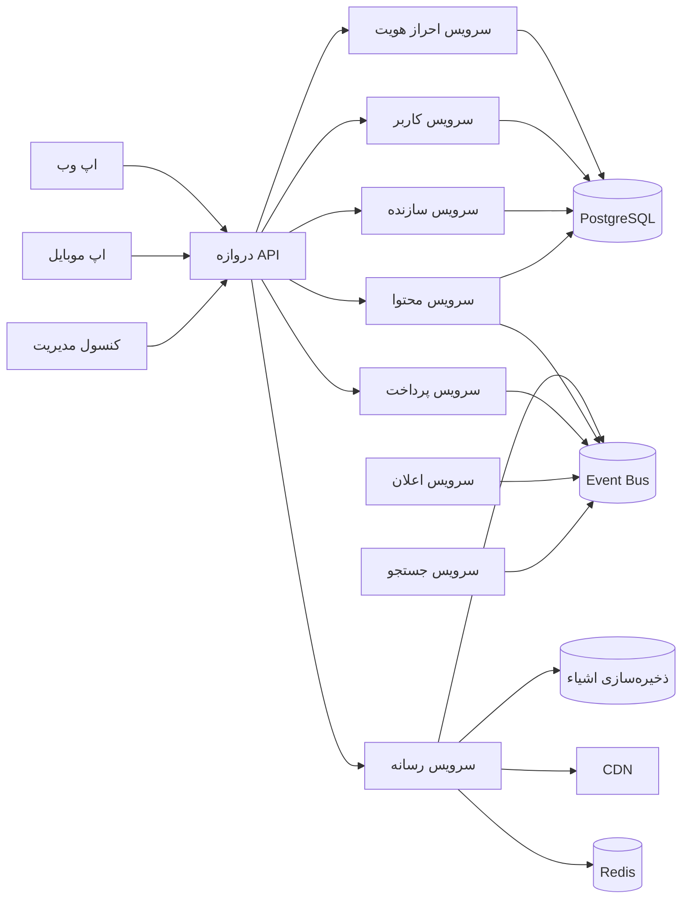

# نقشه معماری پلتفرم

تاریخ: 2026-07-12
حوزه: معماری بلندمدت پلتفرمی برای یک پلتفرم سازنده/رسانه‌ای که قرار است فراتر از 10 میلیون کاربر، 1 میلیون سازنده، میلیاردها فایل رسانه‌ای، پتابایت فضای ذخیره‌سازی و میلیون‌ها بارگذاری روزانه رشد کند.

## 1. خلاصه اجرایی

طرح فعلی مخزن از قبل نشان‌دهنده یک مسیر اولیه قوی است: یک مونورپو با کلاینت‌های وب و موبایل، یک دروازه API، ذخیره‌سازی مبتنی بر Prisma، Redis و فضای ذخیره‌سازی سازگار با S3. این یک پایه خوب است. با این حال، برای پلتفرمی که قرار است در دهه آینده رشد کند، معماری باید از مدل تک‌محور مبتنی بر دروازه به یک پلتفرم مدولار و حوزه‌محور با مرزهای روشن سرویس، یکپارچه‌سازی رویدادمحور و کنترل‌های عملیاتی قوی تکامل پیدا کند.

معماری هدف باید بهره‌وری توسعه‌دهنده را در مونورپو فعلی حفظ کند و در عین حال از اتصال تنگاتنگ بین مسائل کاربر، رسانه، محتوا، پرداخت و زیرساخت پلتفرم جلوگیری کند.

## 2. اصول معماری

1. مدولاری مبتنی بر دامنه
   - هر قابلیت تجاری باید داده‌ها و قراردادهای خود را داشته باشد.
   - دروازه API فقط برای هماهنگی است و نه محل منطق کسب‌وکار.

2. جایگزپذیری برتر از راه‌حل‌های کوتاه‌زمانی
   - هیچ ماژولی نباید به پیاده‌سازی داخلی ماژول دیگر وابسته باشد.
   - از قراردادها، رویدادها و رابط‌های نسخه‌دار استفاده شود.

3. قابل‌مشاهده بودن از همان ابتدا
   - هر سرویس باید لاگ‌های ساختارمند، معیارها و ردیابی‌ها را منتشر کند.
   - هشدارها باید به اهداف سطح سرویس و رویدادهای تجاری مرتبط باشند.

4. امنیت به‌عنوان یک دغدغه پلتفرمی
   - احراز هویت، مجوزدهی، مدیریت رازها، رمزگذاری و قابلیت حسابرسی باید در مرکز معماری قرار گیرند.
   - هیچ سرویس‌ دیگری نباید بدون بررسی به‌طور ضمنی مورد اعتماد قرار بگیرد.

5. معماری رسانه‌محور و ذخیره‌محور
   - رسانه باید به‌عنوان یک حوزه اصلی پلتفرم با ذخیره‌سازی غیرقابل‌تغییر، سیاست‌های زندگی، خطوط پردازش و توزیع CDN در نظر گرفته شود.

6. تفکر پلتفرمی به‌جای تفکر فقط ویژگی‌محور
   - ویژگی‌ها باید بر پایه‌ primitives قابل استفاده مجدد ساخته شوند: هویت، اعلان، رویداد، جستجو، صورتحساب، ذخیره‌سازی و تحلیل.

## 3. مدل عملیاتی هدف

این سیستم باید در چهار لایه سازمان‌دهی شود:

- لایه مشتری: اپ وب، اپ موبایل، ابزار مدیریت.
- لایه لبه و یکپارچه‌سازی: CDN، WAF، دروازه API، ارائه‌دهنده هویت، Event Bus.
- سرویس‌های اصلی دامنه: احراز هویت، کاربران، سازندگان، محتوا، رسانه، کشف، پرداخت و اعلان.
- سرویس‌های داده و پلتفرم: PostgreSQL، Redis، فضای ذخیره‌سازی اشیاء، جستجو، موتور گردش کار، پشته مشاهده‌پذیری.

### معماری مرجع

## 4. توصیه منطبق بر مخزن

مخزن فعلی از قبل دارای پایه‌های اولیه مناسب است:

- هماهنگ‌سازی مونورپو با pnpm و Turbo.
- کلاینت‌های چندپلتفرمی در وب و موبایل.
- دروازه NestJS با ماژول‌هایی برای احراز هویت، محتوا، رسانه، پرداخت و کاربر.
- Prisma به‌عنوان لایه دسترسی به داده.
- Redis و سرویس‌های ذخیره‌سازی سازگار با S3.

تکامل پیشنهادی این است که این ساختار حفظ شود و به‌تدریج دروازه از یک پوسته برنامه به یک لایه واقعی لبه و هماهنگی تبدیل شود.

### ساختار پیشنهادی مخزن

- apps/web
  - تجربه وب عمومی.
  - کلاینت نازک روی APIهای پلتفرم.
- apps/mobile
  - تجربه موبایل.
  - فقط مرزهای وضعیت مشترک و کش سمت کلاینت.
- services/api-gateway
  - ورودی عمومی.
  - احراز هویت، مسیریابی، شکل‌دهی درخواست، محدودسازی نرخ و نسخه‌گذاری API.
- services/auth
  - هویت، OAuth، چرخه عمر توکن و مدیریت نشست.
- services/users
  - پروفایل، حساب، ترجیحات و وضعیت مدیریت محتوا.
- services/creators
  - هویت سازنده، تأیید، آماده‌سازی درآمدزایی و تحلیل‌ سازنده.
- services/content
  - پست‌ها، تولید فید، پیشنهادها و متادیتاهای محتوا.
- services/media
  - هماهنگی بارگذاری، ترنس‌کدینگ، سیاست‌های ذخیره‌سازی و ادغام CDN.
- services/payments
  - صورتحساب، پرداخت‌ها، رویدادهای دفتر کل و بررسی‌های کلاهبرداری.
- services/notifications
  - ایمیل، پوش نوتیفیکیشن، داخل برنامه و وب‌هوک.
- services/search
  - ایندکس‌گذاری جستجو، کشف و رتبه‌بندی.
- packages/shared
  - قراردادهای دامنه، DTOها، enumها، اسکیماهای احراز هویت و رویداد.
- packages/database
  - اسکیما Prisma، مهاجرت‌ها، کلاینت تولیدشده و الگوهای توسعه.

## 5. مرزها و مسئولیت‌های دامنه

### 5.1 هویت و دسترسی

مسئولیت‌ها:
- احراز هویت کاربر و سازنده.
- صدور و بازتازه‌سازی توکن.
- جریان‌های امنیتی چندعاملی و وابسته به دستگاه.
- کنترل دسترسی مبتنی بر نقش و مجوزهای دقیق.

انتخاب‌های طراحی:
- این سرویس باید به‌صورت جداگانه با پایگاه‌داده خود و چرخه عمر توکن ایزوله پیاده‌سازی شود.
- رویدادهای مربوط به هویت مانند user.created، user.updated و creator.verified منتشر شوند.
- از توکن‌های دسترسی کوتاه‌مدت و چرخش Refresh Token استفاده شود.

### 5.2 کاربران و سازندگان

مسئولیت‌ها:
- مدیریت پروفایل.
- ورود و راه‌اندازی سازنده.
- وضعیت حساب، وضعیت مدریت و ترجیحات حریم خصوصی.

انتخاب‌های طراحی:
- دامنه‌های جداگانه برای حساب و سازنده نگه داشته شود تا دامنه بیش از حد شلوغ نشود.
- مدل‌های خواندنی برای دسترسی سبک‌تر توسط مصرف‌کننده منتشر شود.

### 5.3 محتوا و فید

مسئولیت‌ها:
- ساخت، ویرایش، انتشار و نظرات محتوا، روابط و تولید فید.
- مدریت محتوا و کنترل‌های سوءاستفاده.

انتخاب‌های طراحی:
- برای فید و اعلان‌ها از انتشار رویدادمحور استفاده شود.
- معنای سمت نوشتن باید سازگار باشد و منطق فید به سرویس سازنده متصل نشود.

### 5.4 پلتفرم رسانه

مسئولیت‌ها:
- پذیرش بارگذاری، گردش‌کار URL امضا شده، هماهنگی بارگذاری بخش‌بندی‌شده.
- ترنس‌کدینگ، تصاویر بندانگشتی، فرمت‌های تطبیقی و fingerprinting محتوا.
- چرخه عمر ذخیره‌سازی، قوانین حریم خصوصی، نگهداری رسانه و گردش کار حذف.

انتخاب‌های طراحی:
- رسانه به‌عنوان شیء غیرقابل‌تغییر در نظر گرفته شود و متادیتاها در پایگاه داده و داده‌های باینری در فضای ذخیره‌سازی اشیاء نگه‌داری شوند.
- وضعیت متادیتا و پردازش باید از payload باینری جدا باشد.
- به‌جای پردازش همگام در مسیر درخواست، از کارگران غیرهمزمان استفاده شود.
- برای رشد در مقیاس پتابایتی از تکثیر چندمنطقه‌ای و سیاست‌های چرخه عمر پشتیبانی شود.

### 5.5 پرداخت و درآمدزایی

مسئولیت‌ها:
- قصد پرداخت، پرداخت‌ها، دفتر کل درآمد، متادیتای مالیاتی و بازپرداخت‌ها.
- تسویه و تطبیق رویدادمحور.

انتخاب‌های طراحی:
- وضعیت پرداخت در یک سرویس مجزا با قابلیت حسابرسی شدید نگه داشته شود.
- برای انتشار مطمئن رویدادها از الگوی outbox استفاده شود.
- هیچ‌وقت سرویس محتوای یا سرویس سازنده نباید مستقیماً عملیات مالی انجام دهد.

## 6. استراتژی معماری داده

### 6.1 داده‌های عملیاتی

- PostgreSQL به‌عنوان سیستم ثبت داده‌های تراکنشی باقی می‌ماند.
- در صورت رشد حجم، از یک پایگاه داده برای هر دامنه یا معماری چندمستاجری با قطعه‌بندی دقیق استفاده شود.
- نسخه‌گذاری اسکیما، انضباط مهاجرت و دروازه‌های انتشار معرفی شود.
- داده‌های OLTP از بارهای تحلیل جدا نگه داشته شوند.

### 6.2 کشینگ

- Redis برای کش کوتاه‌مدت، محدودسازی نرخ، قفل‌های توزیع‌شده و شتاب‌دهی نشست استفاده شود.
- به Redis به‌عنوان پایگاه داده دائمی اصلی تکیه نشود.

### 6.3 ذخیره‌سازی اشیاء و رسانه

- برای blobهای رسانه از فضای ذخیره‌سازی سازگار با S3 یا جایگزین مدیریت‌شده استفاده شود.
- غیرقابل‌تغییر بودن شیء و متادیتای آن با hash محتوایی و برچسب‌های چرخه عمر حفظ شود.
- برای کاهش تکرار و تأیید یکپارچگی، از ذخیره‌سازی مبتنی بر content-addressed استفاده شود.
- برای تحویل و مجوزدهی از CDN و URLهای امضا شده استفاده شود.

### 6.4 جستجو و کشف

- برای جستجو، رتبه‌بندی و کشف از OpenSearch یا Elasticsearch استفاده شود.
- ایندکس‌گذاری جستجو باید غیرهمزمان و رویدادمحور باشد.
- یک مدل خواندنی جداگانه برای موارد استفاده کشف‌محور نگه داشته شود.

### 6.5 رویداد و یکپارچه‌سازی

- برای رویدادهای دامنه غیرهمزمان از Kafka، NATS یا RabbitMQ استفاده شود.
- رویدادهای دامنه از سرویس‌های authoritative منتشر شوند.
- مصرف‌کننده‌ها باید از قراردادهای روشن و سیاست‌های نسخه‌گذاری استفاده کنند.
- برای جلوگیری از از دست رفتن رویدادها از الگوی outbox استفاده شود.

## 7. استراتژی API و یکپارچه‌سازی

### 7.1 نقش دروازه API

دروازه باید نازک و متمرکز روی عملیات باشد:
- احراز هویت و اعتبارسنجی درخواست.
- مسیریابی به سرویس‌های دامنه.
- محدودسازی نرخ و شکل‌دهی درخواست.
- نسخه‌گذاری API و مشاهده‌پذیری.
- آگاهی از tenant و منطقه.

این لایه نباید منطق کسب‌وکار یا دغدغه‌های پایداری داده را در خود جای دهد.

### 7.2 ارتباط سرویس به سرویس

- برای گردش کارهای چنددامنه از رویدادهای غیرهمزمان استفاده شود.
- درخواست‌های همزمان فقط برای تراکنش‌های کاربرمحور که به بازخورد فوری نیاز دارند به‌کار روند.
- قراردادهای روشن در پکیج‌های مشترک تعریف شوند تا drift اسکیما جلوگیری شود.
- قراردادها نسخه‌دار شوند و حداقل برای یک چرخه انتشار اصلی از سازگاری معکوس پشتیبانی شود.

### 7.3 مدیریت قراردادها

- DTOها، enumها و اسکیماهای رویداد در بسته‌های مشترک نگه داشته شوند.
- تولید OpenAPI و اعتبارسنجی اسکیما در CI انجام شود.
- قراردادهای عمومی به‌عنوان بخشی از سطح محصول در نظر گرفته شوند و مانند APIها مدیریت شوند.

## 8. معماری امنیتی

### 8.1 هویت و مجوزدهی

- در صورت مناسب از OAuth 2.0 / OpenID Connect استفاده شود.
- با مدل‌های مبتنی بر نقش و ویژگی، حداقل امتیازها اجرا شود.
- برای عملیات حساس و مالکیت منابع، بررسی‌های مجوزدهی مرکزی اعمال شود.

### 8.2 رازها و کلیدها

- رازها در یک مدیر راز اختصاصی نگهداری شوند.
- کلیدها و اعتبارها به‌صورت دوره‌ای Rotate شوند.
- هرگز در کد یا Artifactهای ساخت، اعتبارها درج نشوند.

### 8.3 حفاظت از داده

- داده‌ها در حالت استراحت و انتقال رمزگذاری شوند.
- برای رسانه از بارگذاری و تحویل امضا شده استفاده شود.
- لاگ‌های حسابرسی برای اقدامات مدیر و مدریت نگه داشته شوند.
- خطوط پردازش مدریت محتوا و تشخیص سوءاستفاده با گره‌های بازبینی انسانی معرفی شوند.

### 8.4 امنیت زیرساخت

- پشت WAF و لایه‌های محافظ لبه‌ای مستقر شوند.
- در صورت امکان mTLS بین سرویس‌های داخلی اجرا شود.
- محیط‌ها جدا شده و blast radius محدود شود.
- اسکن امنیت زمان اجرا و مدیریت آسیب‌پذیری وابستگی‌ها معرفی شود.

## 9. مشاهده‌پذیری و قابلیت اطمینان

### 9.1 لاگ‌نویسی

- از لاگ‌های ساختارمند با شناسه همبستگی و شناسه درخواست استفاده شود.
- در لبه، سرویس و مرز رویدادهای دامنه لاگ ثبت شود.

### 9.2 معیارها و ردیابی

- تأخیر، نرخ خطا، اشباع، عمق صف و نرخ موفقیت بارگذاری اندازه‌گیری شود.
- برای ردیابی توزیع‌شده از OpenTelemetry استفاده شود.
- ردیابی‌ها به رویدادهای تجاری مانند upload.completed یا content.published مرتبط شوند.

### 9.3 SLO و هشدار

- اهداف سطح سرویس برای احراز هویت، تأخیر بارگذاری، تولید فید، پاسخ‌گویی جستجو و تطبیق پرداخت تعریف شود.
- برای کاهش فنی و تجاری مهم هشدار صادر شود.

### 9.4 مدیریت خطا

- تلاش مجدد با backoff و مدیریت dead-letter طراحی شود.
- در جاهای مناسب از eventual consistency استفاده شود.
- مسیرهای خواندن در صورت در دسترس نبودن سرویس‌های downstream به‌صورت تدریجی و مقاوم دچار degradation شوند.

## 10. استراتژی استقرار و زیرساخت

### 10.1 مدل محیطی

- محیط‌های توسعه، استیج، تولید و بازیابی فاجعه باید ایزوله باشند.
- زیرساخت با IaC با Terraform یا معادل آن فراهم شود.
- تغییرات دستی در محیط تولید جلوگیری شود.

### 10.2 مدل زمان اجرا

- سرویس‌ها در Kubernetes یا پلتفرم کانتینری مدیریت‌شده معادل اجرا شوند.
- برای دروازه‌ها، کارگران رسانه و مصرف‌کننده‌های جستجو از autoscaling استفاده شود.
- محاسبات بدون حالت از پایگاه‌های حالت‌دار جدا شوند.

### 10.3 مدل تحویل

- از خطوط CI/CD با branch protection، بازبینی کد، ارتقاء Artifact و برنامه Rollback استفاده شود.
- Artifactهای غیرقابل‌تغییر بین محیط‌ها ارتقا داده شوند.
- برای تغییرات سرویس از blue/green یا canary استفاده شود.

### 10.4 آمادگی چندمنطقه‌ای

- برای سرویس‌های حیاتی از failover فعال-فعال یا فعال-غیرفعال برنامه‌ریزی شود.
- ترافیک را بر اساس منطقه یا shard داده‌ها برای مقیاس و مقاومت تقسیم کرد.
- راه‌حل‌های replication و recovery پایگاه داده از ابتدا طراحی شوند.

## 11. تجربه توسعه‌دهنده و نگهداری‌پذیری

### 11.1 حاکمیت مخزن

- برای حفظ سرعت مشترک، مونورپو نگه داشته شود.
- مرزهای بسته و قوانین وابستگی اجرا شود.
- هر سرویس باید به‌صورت مستقل استقرارپذیر و تست‌پذیر باشد.

### 11.2 دروازه‌های کیفیت

- قبل از ادغام، typecheck، lint، تست، اسکن امنیت و اعتبارسنجی قرارداد لازم باشد.
- مجموعه تست‌ها شامل تست واحد، یکپارچه، قرارداد و مقاومت باشد.

### 11.3 پرچم‌های ویژگی و آزمایش

- برای تحویل تدریجی از feature flag استفاده شود.
- پیکربندی زمان اجرا از کد جدا شود.
- راه‌اندازی‌های امن و rollback بدون استقرار دوباره همه چیز پشتیبانی شود.

## 12. نقشه راه پیاده‌سازی پیشنهادی

### فاز 1: تثبیت پایه
- ساختار مونورپو و پکیج‌های مشترک حفظ شوند.
- مرزهای دامنه و مالکیت سرویس‌ها تعریف شوند.
- DTOهای contract-first و نسخه‌گذاری اسکیما رویداد معرفی شوند.
- لاگ‌نویسی ساختارمند و معیارها استاندارد شوند.

### فاز 2: تبدیل دروازه به لایه لبه
- مسائل احراز هویت، اعتبارسنجی درخواست و مسیریابی به یک سرویس دروازه اختصاصی منتقل شوند.
- سرویس‌های دامنه برای کاربران، سازندگان و محتوا معرفی شوند.
- outbox و جریان‌های رویدادمحور اضافه شوند.

### فاز 3: ساخت پلتفرم رسانه به‌عنوان زیرسیستم اصلی
- هماهنگی بارگذاری، کارگران ترنس‌کدینگ، سیاست‌های ذخیره‌سازی و ادغام CDN معرفی شوند.
- متادیتای شیء غیرقابل‌تغییر و مدیریت URL امضا شده اضافه شود.
- پردازش صف‌محور و اتوماسیون چرخه عمر اضافه شود.

### فاز 4: مقیاس‌پذیری برای عملیات جهانی
- استقرار چندمنطقه‌ای، ایندکس‌گذاری جستجو در مقیاس بالا و خطوط تحلیل معرفی شوند.
- مشاهده‌پذیری و خودکارسازی پاسخ به حادثه گسترش یابد.
- امنیت، انطباق و بازیابی فاجعه تقویت شوند.

## 13. تصمیم‌های معماری کلیدی که باید همین حالا گرفته شوند

1. مونورپو را حفظ کنید، اما مرزهای بسته را با جدیت اجرا کنید.
2. دروازه API را فقط به‌عنوان لبه/هماهنگ‌ساز در نظر بگیرید.
3. منطق کسب‌وکار را به سرویس‌های قابل استقرار مستقل منتقل کنید.
4. ذخیره‌سازی و پردازش رسانه را به‌عنوان زیرسیستم جداگانه در نظر بگیرید.
5. برای جریان‌های چنددامنه از یکپارچه‌سازی رویدادمحور استفاده کنید.
6. مشاهده‌پذیری، امنیت و IaC را از روز اول به‌عنوان پایه در نظر بگیرید.

## 14. توصیه نهایی

مخزن از قبل دارای پایه‌ای معتبر است، اما باید از یک اسکلت برنامه‌ای مدولار به یک معماری پلتفرمی تبدیل شود که بر پایه سرویس‌های دامنه، یکپارچه‌سازی رویدادمحور، مرزهای داده‌ای قوی و نظم عملیاتی ساخته شده باشد. مهم‌ترین تصمیم معماری این است که از تبدیل دروازه API و پکیج‌های مشترک به انباره‌ای برای منطق کسب‌وکار جلوگیری شود. اگر پلتفرم مدولار، قابل‌مشاهده و مبتنی بر قرارداد باقی بماند، مسیر واقعی برای نگهداری و تکامل در دهه آینده را خواهد داشت.
