# طراحی کامل معماری نرم‌افزار پلتفرم

تاریخ: 2026-07-12
حوزه: معماری کامل برای یک پلتفرم رسانه/سازنده با رشد بلندمدت، با تمرکز بر نگهداری‌پذیری، ماژولار بودن، مقیاس‌پذیری، مشاهده‌پذیری و امکان تکامل به سمت خدمات میکرو.

## 1. جمع‌بندی راهبردی

این معماری از یک معماری مدولار-مونولیت شروع می‌کند، نه از یک پراکندگی زودهنگام به میکروسرویس‌ها. دلیل این انتخاب این است که در ابتدای مسیر، نیاز به سرعت توسعه، سادگی عملیات، کاهش هزینه‌ی نگهداری و حفظ مرزهای واضح دامنه وجود دارد. در عین حال، ساختار به‌گونه‌ای طراحی شده که هر ماژول از نظر قرارداد، داده و جریان رویداد، مستقل و قابل جداسازی باشد.

این معماری به‌جای یک لایه‌بندی سنتی ساده، از مدل زیر استفاده می‌کند:

- لبه و ورود: API Gateway، WAF، CDN، AuthN/AuthZ
- لایه‌ی دامنه: ماژول‌های مستقل با مالکیت داده
- لایه‌ی پلتفرم: پایگاه داده، کش، ذخیره‌سازی، جستجو، رویداد، اعلان، تحلیل
- لایه‌ی جریان‌های عملیاتی: پردازش رسانه، AI،推薦، اعلان و جستجو

## 2. اصول اصلی طراحی

1. مالکیت دامنه در سطح ماژول
   - هر ماژول داده، قرارداد و چرخه عمر خود را دارد.
   - هیچ ماژولی نباید به‌طور مستقیم به دیتای ماژول دیگری دسترسی داشته باشد.

2. رویدادمحور بودن به‌جای وابستگی مستقیم
   - بین ماژول‌ها از رویدادها و قراردادهای نسخه‌دار استفاده می‌شود.
   - این موضوع باعث کاهش coupling و بهبود استقلال می‌شود.

3. لبه‌ی مشترک، نه منطق کسب‌وکار در دروازه
   - Gateway فقط ورود، احراز هویت، مسیریابی، throttling و versioning را انجام می‌دهد.

4. رسانه و AI به‌عنوان زیرسیستم‌های جداگانه
   - بارگذاری، پردازش، ترنس‌کدینگ و تحلیل تصویر/صدا به‌صورت جداگانه و قابل مقیاس‌سازی پیاده‌سازی می‌شود.

5. مشاهده‌پذیری و کنترل‌های امنیتی از ابتدا
   - همه‌ی سطوح لاگ، متریک، trace و سیاست‌های امنیتی دارند.

## 3. معماری سطح بالا (High Level Architecture)

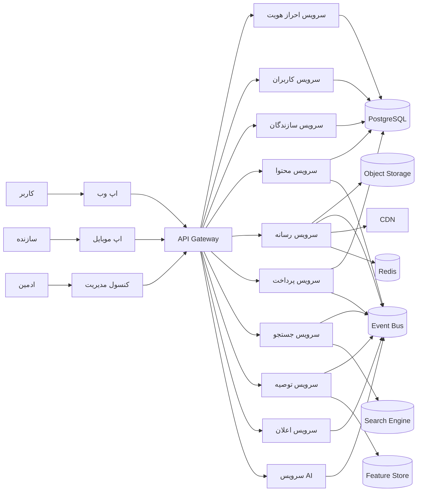

### دلیل انتخاب این ساختار
- کلاینت‌ها فقط به یک لبه‌ی مشترک متصل می‌شوند تا تغییرات در سمت سرور تأثیر کمتری روی سمت کاربر داشته باشد.
- هر ماژول از طریق قراردادهای شفاف برای تعامل با دیگر ماژول‌ها آماده است.
- این معماری برای رشد به سمت خدمات جداگانه، بدون بازنویسی کلی، قابل تکامل است.

## 4. دیاگرام Context Diagram

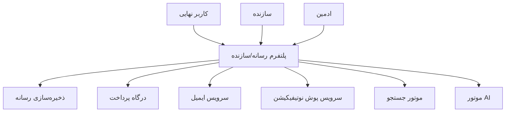

### چرا این مدل مناسب است
- مرزهای خارجی سیستم دقیق مشخص شده‌اند.
- وابستگی‌های خارجی از قلب کسب‌وکار جدا شده‌اند.
- در آینده می‌توان این وابستگی‌ها را با Providerهای جایگزین تعویض کرد.

## 5. دیاگرام Container Diagram

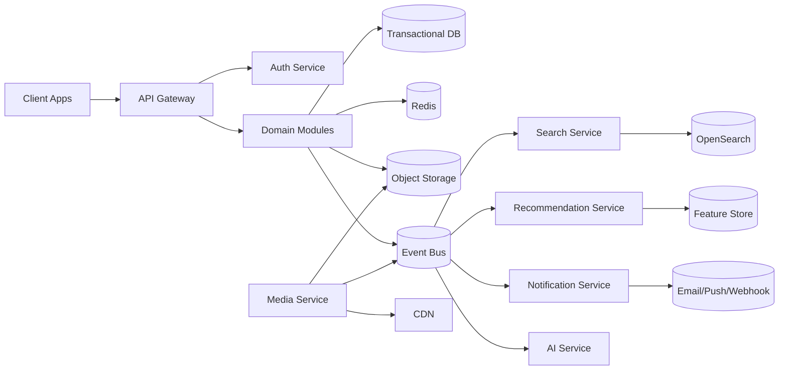

### تصمیم معماری در این بخش
- API Gateway یک لبه‌ی مشترک است، نه یک «سرویس کسب‌وکار».
- پایگاه داده‌ی تراکنشی برای داده‌های اصلی، کش برای سرعت، و Object Storage برای رسانه‌های حجیم جدا شده‌اند.
- هر سرویس/ماژول دارای کانتینر مستقل و قابل استقرار است.

## 6. دیاگرام Component Diagram

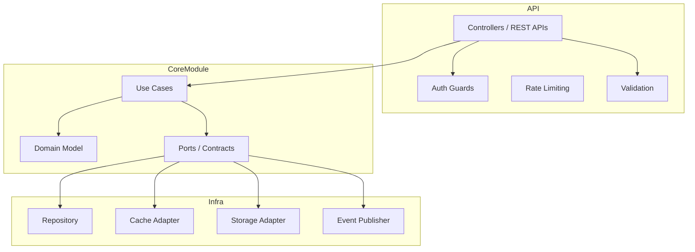

### دلیل طراحی این لایه
- ماژول‌ها از الگوی ports-and-adapters استفاده می‌کنند تا در آینده امکان جایگزینی زیرساخت وجود داشته باشد.
- منطق دامنه و لایه‌ی زیرساخت از هم جدا شده‌اند.
- این ساختار برای تست‌پذیری و نگهداری بسیار مناسب است.

## 7. دیاگرام Module Diagram

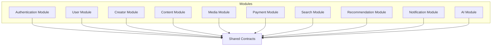

### چرا ماژول‌ها جدا شده‌اند
- هر ماژول حوزه‌ی مسئولیت مشخصی دارد.
- در صورت نیاز، هر ماژول می‌تواند در آینده به سرویس مستقل تبدیل شود بدون اینکه کل سیستم دچار تغییر شود.
- این نوع طراحی مانع رشد «کدهای شلوغ و همه‌چیزدان» می‌شود.

## 8. دیاگرام Package Diagram

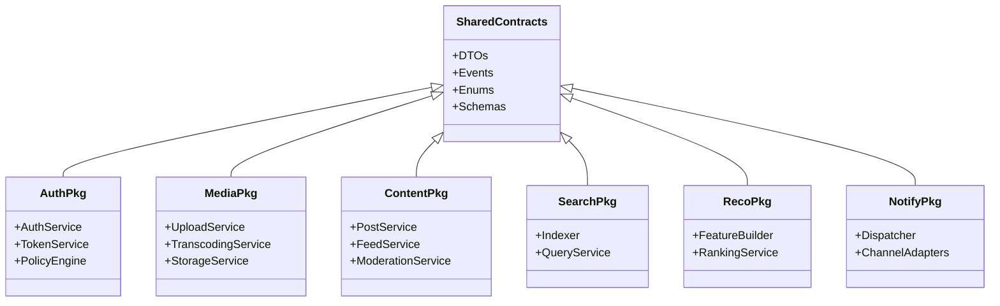

### دلیل این انتخاب
- بستگی‌های میان بسته‌ها روشن و قابل مدیریت هستند.
- هر بسته برای خودِ دامنه‌ی مشخصی طراحی شده است.
- در آینده، هر بسته می‌تواند به یک سرویس مستقل تبدیل شود.

## 9. دیاگرام Deployment Diagram

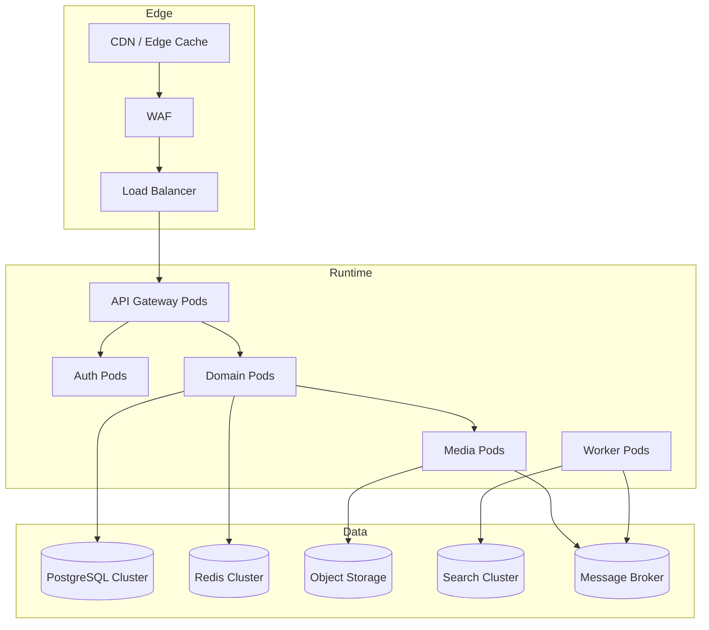

### چرا این استقرار مناسب است
- لبه و Runtime از داده جدا شده‌اند.
- مقیاس‌پذیری افقی برای هر سرویس و worker جداگانه ممکن است.
- استقرار با rollback و canary برای محیط‌های پرخطر امکان‌پذیر است.

## 10. دیاگرام Event Flow Diagram

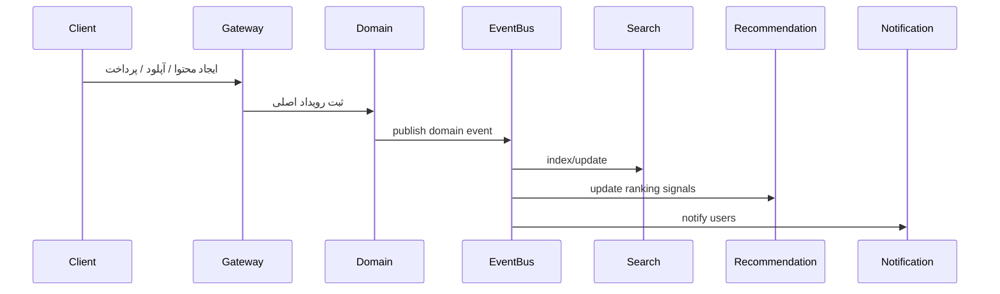

### دلیل استفاده از رویداد
- در زمان پیکربندی، سرویس‌ها از هم مستقل می‌شوند.
- اگر یکی از downstreamها در دسترس نباشد، سیستم به‌جای توقف، به‌صورت تدریجی ادامه می‌دهد.
- این مدل برای داده‌های حجیم و جریان‌های ناهمزمان ایده‌آل است.

## 11. دیاگرام Request Flow Diagram

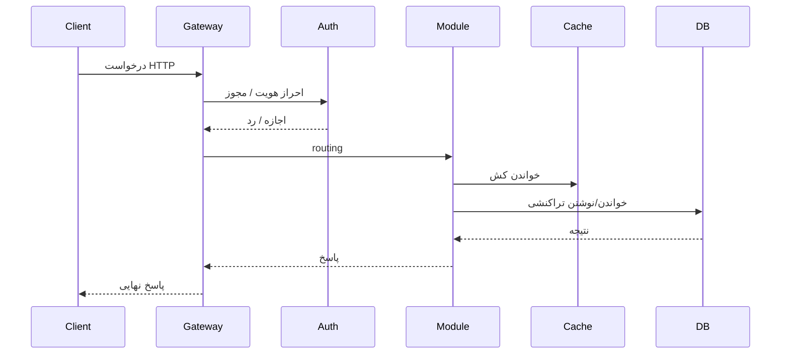

### تصمیم ارائه‌شده
- جریان درخواست از لبه شروع می‌شود و در لایه‌ی ماژول به پایان می‌رسد.
- این مدل برای debugging و trace‌پذیری بهتر است.
- هر مرحله از request در سطح مناسب قابل مشاهده و کنترل است.

## 12. Authentication Flow

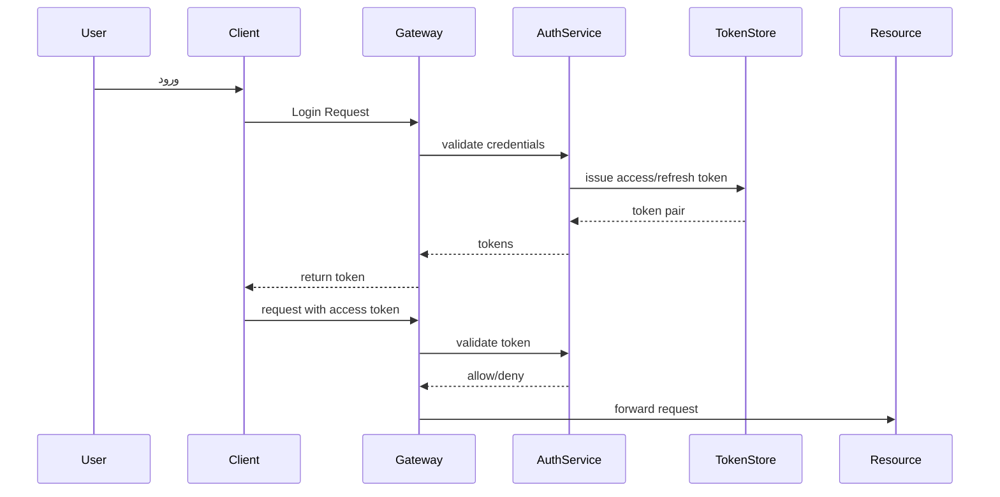

### دلیل طراحی
- احراز هویت به‌صورت جداگانه و قابل جایگزینی پیاده‌سازی می‌شود.
- access token و refresh token با چرخه عمر واضح نگه داشته می‌شوند.
- این مدل برای ورود با چند دستگاه و سیاست‌های امنیتی آینده مناسب است.

## 13. Upload Flow

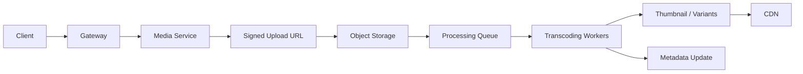

### تصمیم طراحی
- بارگذاری مستقیم به فضای ذخیره‌سازی با URL امضا شده انجام می‌شود تا بار روی API Gateway کاهش یابد.
- پردازش رسانه غیرهمزمان انجام می‌شود تا تجربه کاربر سریع‌تر شود.
- این مدل برای میلیون‌ها فایل و حجم بالای داده مناسب است.

## 14. Streaming Flow

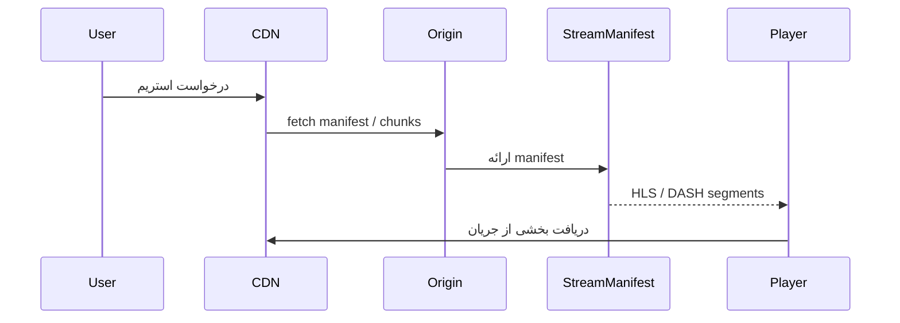

### چرا این طراحی مناسب است
- CDN از حمله‌ی بار روی origin جلوگیری می‌کند.
- استریم با فرمت‌های استاندارد و نسخه‌های چندگانه انجام می‌شود.
- برای مصرف جهانی و پایدار بودن، این مدل بسیار مناسب است.

## 15. Search Flow

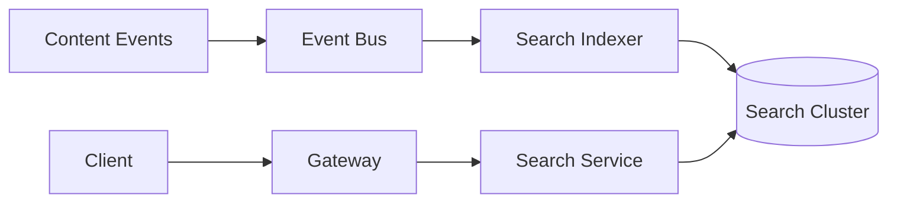

### دلیل طراحی
- جستجو از مسیر نوشتن جدا شده است.
- ایندکس‌گذاری رویدادمحور و غیرهمزمان است.
- این روش برای حجم بالای محتوا و جستجوهای مکرر مناسب است.

## 16. Recommendation Flow

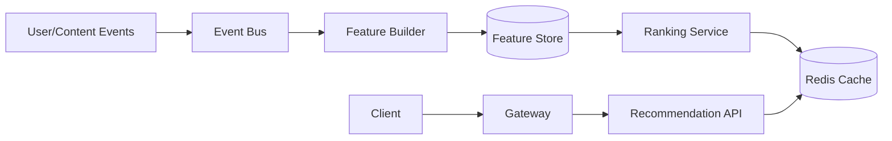

### دلیل طراحی
- الگوریتم‌های توصیه از منطق اصلی جدا شده‌اند.
- داده‌های ویژگی در یک لایه‌ی مجزا نگه‌داری می‌شود.
- این مدل برای آینده‌ی AI و ML قابل توسعه است.

## 17. Notification Flow

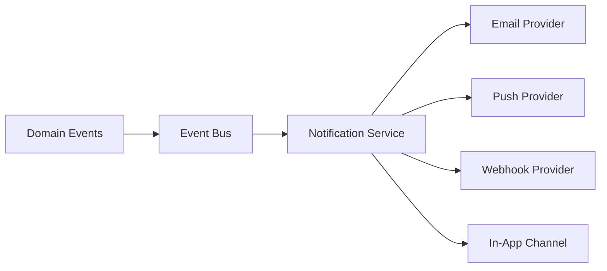

### تصمیم معماری
- اعلان‌ها یک زیرسیستم مستقل‌اند، نه بخشی از منطق هر سرویس.
- این موضوع باعث می‌شود رفتار اعلان‌ها بدون تغییر در حوزه‌های دیگر گسترش یابد.
- برای افزونگی و راه‌اندازی چندپلتفرمی بسیار مناسب است.

## 18. AI Pipeline

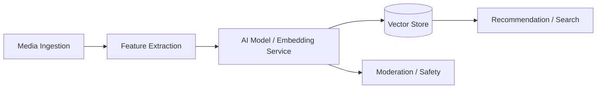

### دلیل طراحی
- خط لوله AI به‌صورت جداگانه و قابل جایگزینی پیاده‌سازی می‌شود.
- مدل‌های مختلف می‌توانند بدون تغییر در هسته‌ی سیستم جایگزین شوند.
- این مدل برای آینده‌ی analytics و smart discovery مناسب است.

## 19. Media Pipeline

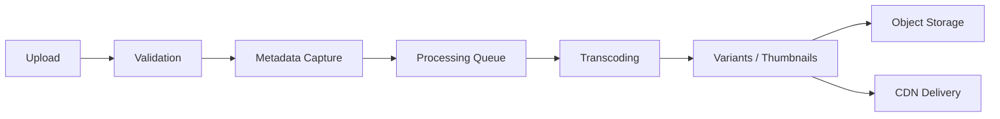

### چرا این تقسیم‌بندی مهم است
- لایه‌ی بارگذاری از لایه‌ی پردازش جدا شده است.
- هر مرحله مستقل و مقیاس‌پذیر است.
- برای حجم بالای فایل و سطوح مختلف کیفیت، این ساختار ضروری است.

## 20. Creator Workflow

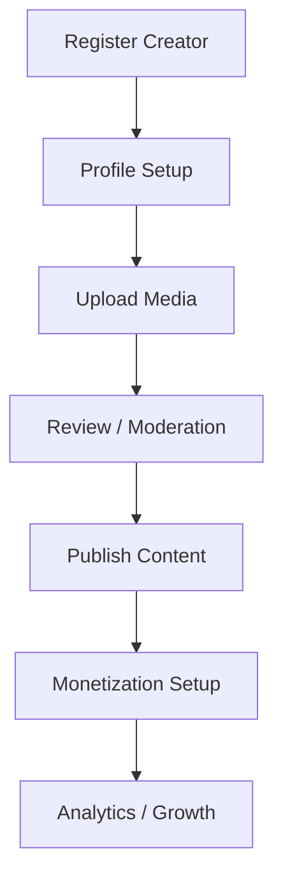

### دلیل این گردش‌کار
- مسیر سازنده با مرزهای مشخص و قابل گسترش طراحی شده است.
- هر مرحله به مرجع داده‌ی خود وابسته است و از دیگر مراحل مستقل است.
- این مدل برای ورود سازندگان و رشد آنها مناسب است.

## 21. User Workflow

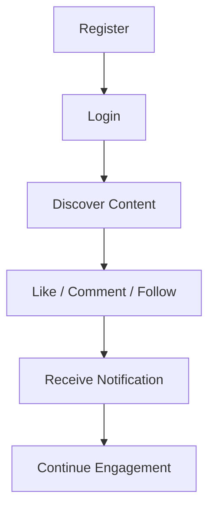

### دلیل طراحی این گردش‌کار
- تجربه کاربر از هسته‌ی پلتفرم جدا شده و با رویدادها پشتیبانی می‌شود.
- این مسیر در آینده به‌راحتی با تجربه‌های جدید مثل live، watch later و recommendation تقویت می‌شود.

## 22. چرا این معماری بهتر از معماری لایه‌ای سنتی است

معماری لایه‌ای سنتی معمولاً به این شکل است:

- Presentation -> Application -> Domain -> Infrastructure
- همه‌ی منطق در یک جریان افقی و به‌صورت خطی حرکت می‌کند.
- در صورت رشد، تغییر در یک بخش باعث تغییر در بخش‌های زیادی می‌شود.

این معماری بهتر است چون:

1. مرزهای دامنه واضح‌تر است
   - هر ماژول مالک داده و قرارداد خود است.
   - تغییر در یک حوزه، تأثیر کمتری روی حوزه‌های دیگر دارد.

2. مقیاس‌پذیری بهتر است
   - رسانه، جستجو، اعلان، AI و کارهای هم‌زمان به‌صورت جداگانه مقیاس می‌شوند.
   - لایه‌ی وب و API Gateway از لایه‌ی پردازش جدا شده‌اند.

3. استقلال توسعه بهتر است
   - تیم‌های مختلف می‌توانند روی ماژول‌های مختلف مستقل کار کنند.
   - Merge conflicts و وابستگی‌های کد پایین‌تر می‌آیند.

4. مقاومت در برابر خرابی بالاتر است
   - خرابی یک ماژول، کل پلتفرم را از کار نمی‌اندازد.
   - رویدادها و queueها باعث می‌شوند سیستم به‌جای توقف، در حالت degradation ادامه دهد.

5. برای آینده نگهداری‌پذیرتر است
   - در آینده، هر ماژول با حداقل تغییر به یک سرویس جداگانه تبدیل می‌شود.

## 23. چرا Modular Monolith انتخاب شده است

Modular Monolith به این معناست که هنوز یک کدبیس واحد داریم، اما آن را به ماژول‌های مستقل با مرزهای روشن تقسیم کرده‌ایم.

### دلایل انتخاب

1. سادگی عملیات
   - استقرار و مانیتورینگ ساده‌تر است نسبت به هزاران سرویس.
   - هزینه‌ی نگهداری و پیچیدگی مدیریت پایین‌تر است.

2. سرعت توسعه در آغاز کار
   - تیم می‌تواند سریع‌تر به‌سرعت راه‌اندازی کند.
   - نیاز به service discovery، API gateway چندگانه و مدیریت چندین deployment در ابتدا وجود ندارد.

3. حفظ مرزهای خوب از همان ابتدا
   - ماژول‌ها به‌صورت قراردادی و با قراردادهای روشن طراحی می‌شوند.
   - همین مرزها در آینده به‌خوبی برای جداسازی به میکروسرویس‌ها استفاده می‌شوند.

4. مناسب برای تیم‌های متوسط تا بزرگ
   - اگر تیم هنوز به اندازه‌ی کافی بزرگ نیست، مدیریت میکروسرویس‌ها هزینه‌بر و پرریسک است.

5. کاهش پرهزینه‌ی زودهنگام
   - استخراج زودهنگام به میکروسرویس، معمولاً منجر به over-engineering و پیچیدگی مدیریت می‌شود.

## 24. چگونه این معماری در آینده به میکروسرویس تبدیل می‌شود

انتقال به میکروسرویس نباید از همان ابتدا انجام شود. بهتر است در چند مرحله انجام شود.

### مرحله 1: تثبیت Modular Monolith
- مرزهای ماژول‌ها روشن شده‌اند.
- هر ماژول از قراردادهای مشترک و رویدادهای نسخه‌دار استفاده می‌کند.
- پایگاه داده‌ی مشترک هنوز در سطح منطقی کنترل می‌شود.

### مرحله 2: جداسازی سرویس‌های پرریسک
- سرویس رسانه، جستجو و اعلان به‌عنوان اولین سرویس‌های قابل جداسازی انتخاب می‌شوند.
- چرا؟ چون این حوزه‌ها از نظر حجم بار، نیاز به مقیاس و استقلال بیشتر، مناسب‌ترند.

### مرحله 3: جدا شدن از دیتابیس مشترک
- هر سرویس مالکیت داده‌ی خود را پیدا می‌کند.
- از دیتابیس مشترک به چند پایگاه داده‌ی مستقل و owner-based مهاجرت انجام می‌شود.

### مرحله 4: معرفی سرویس‌دیسکاوری و کنترل‌های بیشتر
- Service Mesh، API Gateway مستقل، Circuit Breaker، Retry، Load Balancer و Observability عمیق‌تر می‌شود.

### مرحله 5: کاهش تعهدات در سطح سازمانی
- تیم‌ها به‌صورت مستقل روی سرویس‌های خود کار می‌کنند.
- استقرار، دیتابیس و پایداری هر سرویس جداگانه مدیریت می‌شود.

### نکته مهم
- این معماری برای تبدیل به میکروسرویس آماده است چون:
  - مرزهای دامنه واضح‌اند
  - قراردادهای بین ماژول‌ها از قبل در قالب contracts/events تعریف شده‌اند
  - لبه‌ی مشترک و زیرساخت‌های پلتفرم از قبل جدا شده‌اند

## 25. تصمیم‌های کلیدی نهایی

1. دروازه API فقط لبه‌ی ورود است نه محل منطق کسب‌وکار.
2. داده‌ی تراکنشی، رسانه و جستجو از هم جدا شده‌اند.
3. رویدادها برای یکپارچه‌سازی بین ماژول‌ها استفاده می‌شوند.
4. Modular Monolith برای شروع انتخاب شده است چون ساده‌تر و قابل مدیریت‌تر است.
5. هر ماژول در آینده قابل استخراج به سرویس مستقل است.
6. این معماری نسبت به لایه‌بندی سنتی از نظر مقیاس، نگهداری، تست و تکامل برتری دارد.
